author: Joyce
id: air-quality
summary: Automate air filtration with air quality sensors
categories: Data, Getting-Started, Developer 
environments: web
status: Published 
feedback link: https://github.com/viam-labs/viamcodelabs/issues
tags: Getting Started, Developer, Data

# Automate air filtration with air quality sensors
<!-- ------------------------ -->
## Overview 
Duration: 2

Leaving an air filtration system running at all times is inefficient but you also don't want to forget to turn it on after the air quality has already reached concerning levels. Use Viam to automate an air filtration system using air quality sensors and an air filter attached to a box fan. Set up a conditional workflow to turn on the air filtration when particulate values rise above a specified threshold, and then turn it off again when the air is clean. 

Instead of leaving the air filtration running at all times, or forgetting to turn it on, this is a way to automatically remove household pollutants and allergens from the air in your home.


### Prerequisites
- Sign up for a free Viam account, and then [sign in](https://app.viam.com/robots/) to the Viam app
- Hardware and supplies requirements
  - 1 - [Raspberry Pi 5](https://www.amazon.com/Raspberry-Pi-Quad-core-Cortex-A76-Processor/dp/B0CTQ3BQLS/)
  - 1 - [USB flash drive](https://www.amazon.com/Samsung-MUF-128AB-AM-Plus-128GB/dp/B07D7PDLXC/) or microSD card to use with your Pi
   - 1 - USB cable to power your Pi
  - 1 - Store-bought or 3D-printed Raspberry Pi case ([like this one here](https://www.printables.com/model/742926-raspberry-pi-5-case))
  - 1 - [PM2.5 air quality sensor (with G7 transfer board)](https://www.amazon.com/Precision-Quality-Monitoring-Particle-Concentration/dp/B0B1J8FQ7M)
  - 4 - jumper wires to connect the air sensor to the Pi
  - 1 - [Kasa smart plug](https://www.amazon.com/Kasa-Smart-Supported-Scheduling-KP125/dp/B0CRRY18Z4/) (supported Kasa models: EP10, EP25, HS100, HS103, HS105, HS110, KP100, KP105, KP115, KP125, KP125M, KP401)
  - 1 – [20” Box Fan](https://www.amazon.com/Genesis-Settings-Cooling-Technology-Handle/dp/B0854FY793/)
  - 1 - [20” x 20” x 1" MERV 13 electrostatic air filter](https://www.amazon.com/BNX-20x20x1-MERV-Filter-Pack/dp/B09XC3RQ3J/) (most effective 11-13)
  - 4 - [3D-printed clips](https://www.thingiverse.com/thing:968923) (or duct tape to attach the air filter to the box fan)

### What You’ll Learn 
- How to use modules from [the Viam registry](https://docs.viam.com/registry/)
- How to set up a continuously running [process](https://docs.viam.com/configure/processes/) on a Viam machine
- How to use environment variables with your Viam machine
- How to move control code to your machine

### What You’ll Need 
- A computer with MacOS, Windows, or Linux
- A smartphone to download and use the Kasa mobile app
- [VS Code](https://code.visualstudio.com/download) installed, or your preferred code editor
- [Python3](https://www.python.org/downloads/) installed

### What You’ll Build 
- An air quality monitor that triggers an air filtration system when detected values of particulate (PM2.5) exceeds a certain threshold

  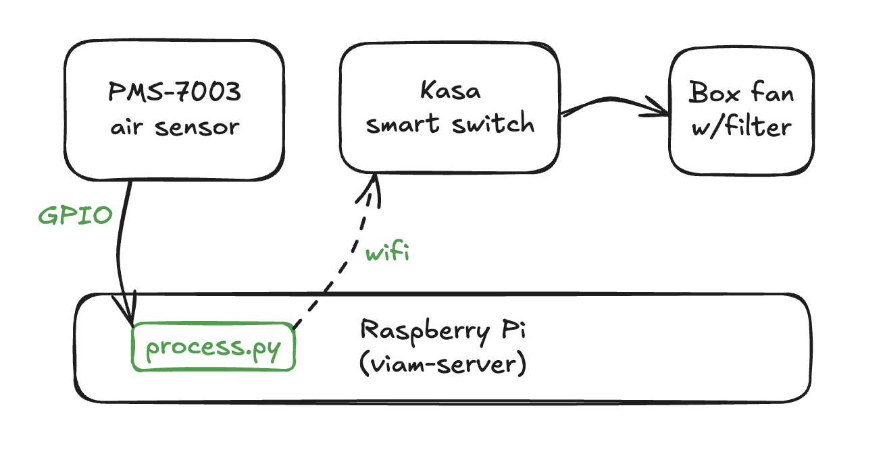

### Watch the Video

Follow along with the step-by-step video.

<!-- <video id="KaJIXznpssw"></video> -->

<!-- ------------------------ -->
## Set up your air monitoring device
Duration: 3

### Set up your air monitoring device

The PMS7003 particulate sensor measures the air quality and transmits data in a [serial stream](https://en.wikipedia.org/wiki/Serial_communication) from the transmitter pin (TX) to the receiver pin (RX pin) on the Raspberry Pi.

  

Refer to the following wiring diagram to connect the Raspberry Pi to the PMS7003 air monitoring device.

  

- Pin 4 (3V) to VCC (Power)
- Pin 6 (GND) to GND (Ground)
- Pin 8 (TX) to RX (receiver)
- Pin 10 (RX) to TX (transmitter)

To power the Raspberry Pi, you can use the USB cord from earlier to continue providing power from your computer, or use a separate USB power supply.

> aside negative
> Make sure to use an appropriate 5V power supply to run the Raspberry Pi, so you don't damage the device.

<!-- ------------------------ -->
## Set up your air filter
Duration: 3

### Set up your air filter

Make your own air purifier by combining a box fan and air filter to effectively clean the air in a small to medium sized, closed room.

1. Attach the filter to the back of the fan, ensuring the airflow arrow points toward the fan. The fan should **pull air through the filter** when operating. If the filter will block access to the fan's power knob, now is a good time to switch it to an `on` position.
1. Secure the filter using 3D-printed clips or duct tape. Write the date when the filter is first used directly on the filter.
  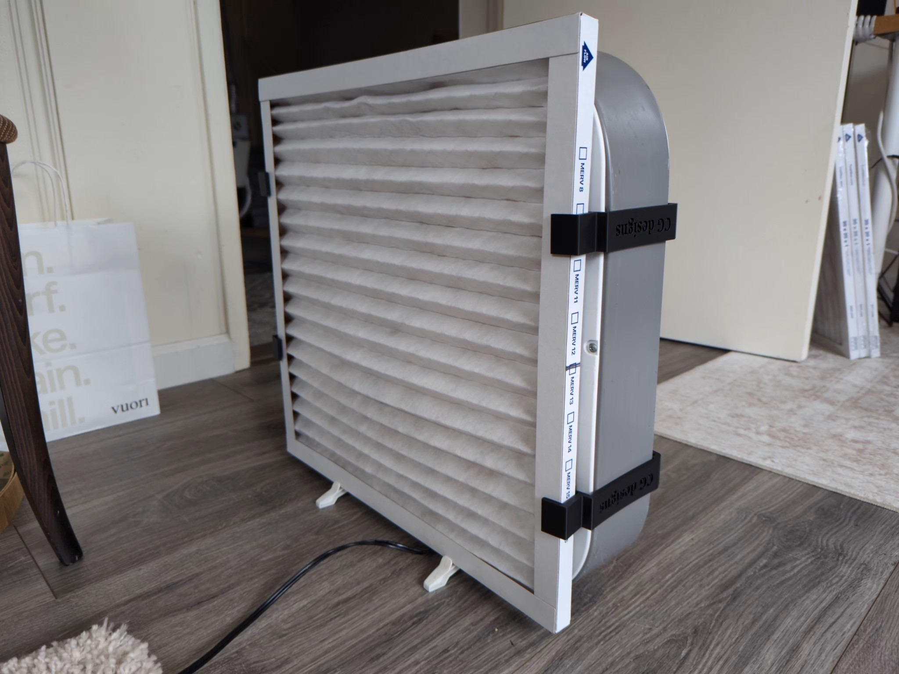

### Set up your smart plug
1. Plug your Kasa smart plug into a power outlet. 
1. Set up your smart plug and connect it to your local Wifi [using the Kasa mobile app](https://www.tp-link.com/us/support/faq/946/) from the App Store or Google Play. 
1. Find your smart plug's IP address on your router's admin page. From a web browser, enter your router's IP address (commonly `192.168.1.1` or `192.168.0.1`) and log in using your admin username and password. Look for a section like "Connected Devices," "Device List," or "DHCP Clients." Locate your Kasa smart plug by its name, MAC address (shown in the Kasa mobile app), or manufacturer name (usually TP-Link). Make a note of the IP address since we'll need it again soon.
    > aside negative
    > **Command line alternative** install the [`python-kasa`](https://python-kasa.readthedocs.io/en/stable/index.html) library, and enter the command `kasa discover` to locate the IP address of the connected device.
1. Plug the box fan into the Kasa smart plug. 
  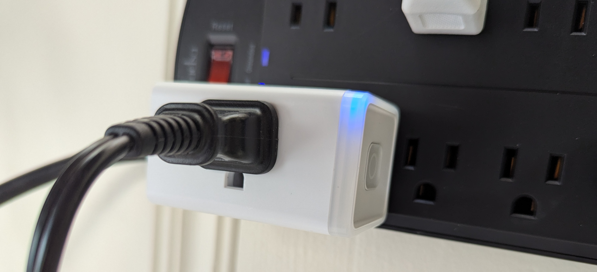

<!-- ------------------------ -->
## Set up your Raspberry Pi
Duration: 6

The Raspberry Pi boots from a USB flash drive (or microSD card). You need to install Raspberry Pi OS on a USB flash drive that you will use with your Pi. For more details about alternative methods of setting up your Raspberry Pi, refer to the [Viam docs](https://docs.viam.com/installation/prepare/rpi-setup/#install-raspberry-pi-os).

### Install Raspberry Pi OS
1. Connect the USB flash drive (or microSD card) to your computer.
1. Download the [Raspberry Pi Imager](https://www.raspberrypi.com/software/) and launch it.
  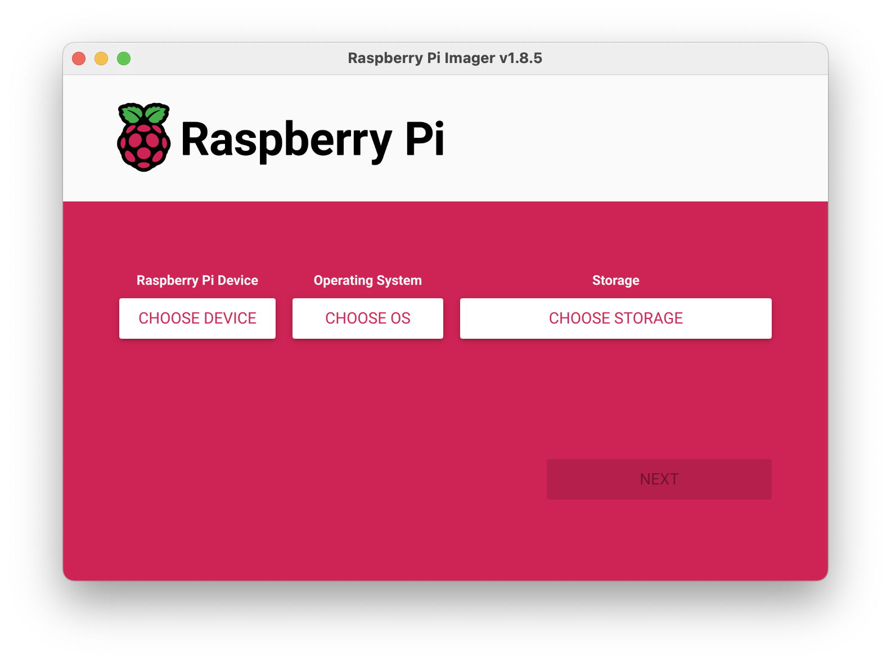
1. Click **CHOOSE DEVICE**. Select your model of Pi, which is Raspberry Pi 5.
1. Click **CHOOSE OS**. Select **Raspberry Pi OS (64-bit)** from the menu.
1. Click **CHOOSE STORAGE**. From the list of devices, select the USB flash drive you intend to use in your Raspberry Pi.
  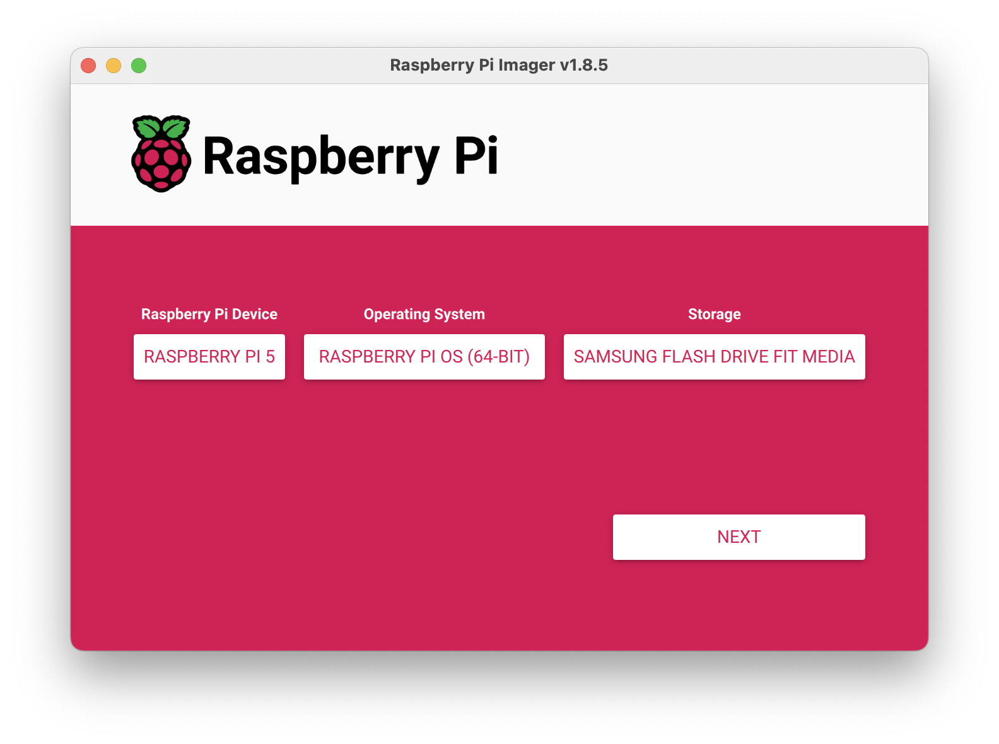
1. Configure your Raspberry Pi for remote access. Click **Next**. When prompted to apply OS customization settings, select **EDIT SETTINGS**.
1. Check **Set hostname** and enter the name you would like to access the Pi by in that field, for example, `air`.
1. Select the checkbox for **Set username and password** and set a username (for example, your first name) that you will use to log into the Pi. If you skip this step, the default username will be `pi` (not recommended for security reasons). And specify a password.
1. Connect your Pi to Wi-Fi so that you can run `viam-server` wirelessly. Check **Configure wireless LAN** and enter your wireless network credentials. SSID (short for Service Set Identifier) is your Wi-Fi network name, and password is the network password. Change the section `Wireless LAN country` to where your router is currently being operated.
  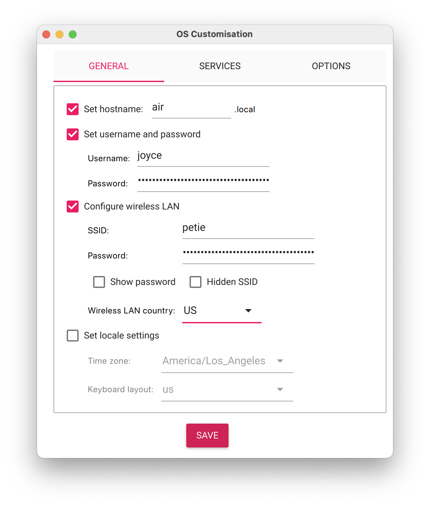
1. Select the **SERVICES** tab, check **Enable SSH**, and select **Use password authentication**.
    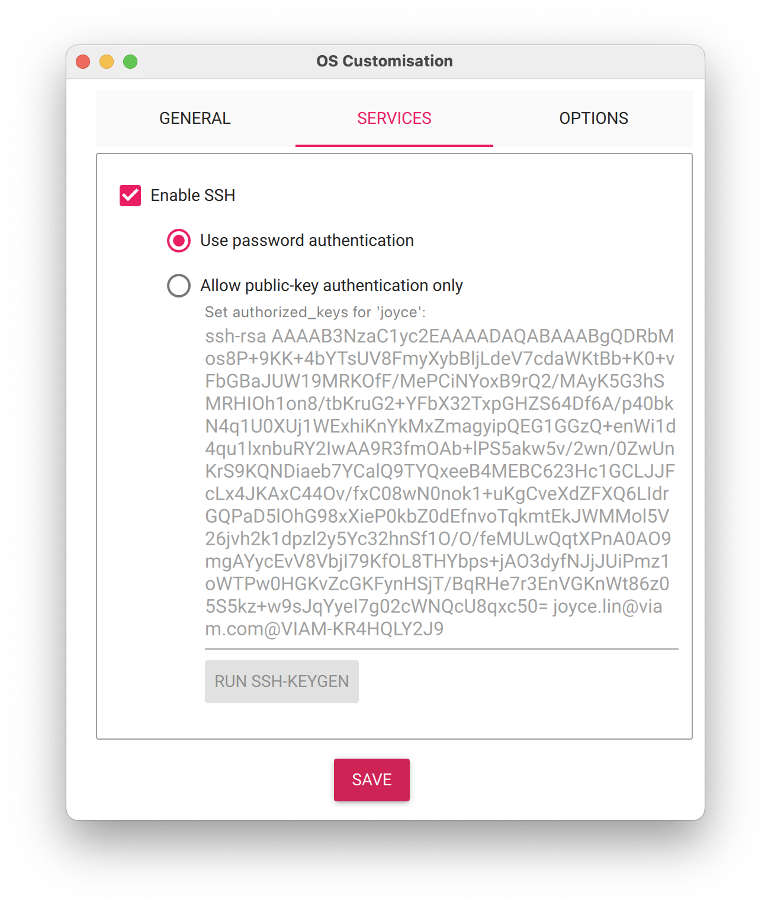
    > aside negative
    > Be sure that you remember the `hostname` and `username` you set, as you will need this when you SSH into your Pi.
1. **Save** your updates, and confirm `YES` to apply OS customization settings. Confirm `YES` to erase data on the USB flash drive. You may also be prompted by your operating system to enter an administrator password. After granting permissions to the Imager, it will begin writing and then verifying the Linux installation to the USB flash drive.
1. Remove the USB flash drive from your computer when the installation is complete.

### Connect with SSH

1. Place the USB flash drive into your Raspberry Pi and boot the Pi by plugging it in to an outlet. A red LED will turn on to indicate that the Pi is connected to power.
1. Once the Pi is started, connect to it with SSH. From a command line terminal window, enter the following command. The text in <> should be replaced (including the < and > symbols themselves) with the user and hostname you configured when you set up your Pi.
    ```bash
    ssh <USERNAME>@<HOSTNAME>.local
    ```
1. If you are prompted “Are you sure you want to continue connecting?”, type “yes” and hit enter. Then, enter the password for your username. You should be greeted by a login message and a command prompt.
    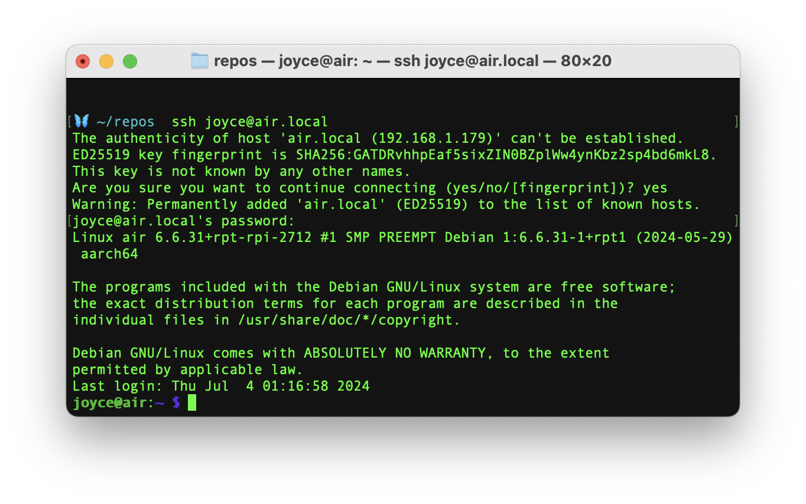
1. Update your Raspberry Pi to ensure all the latest packages are installed
    ```bash
    sudo apt update
    sudo apt upgrade
    ```

### Enable communication protocols

1. Launch the Pi configuration tool by running the following command
    ```bash
    sudo raspi-config
    ```
1. Use your keyboard to select “Interface Options”, and press return.
    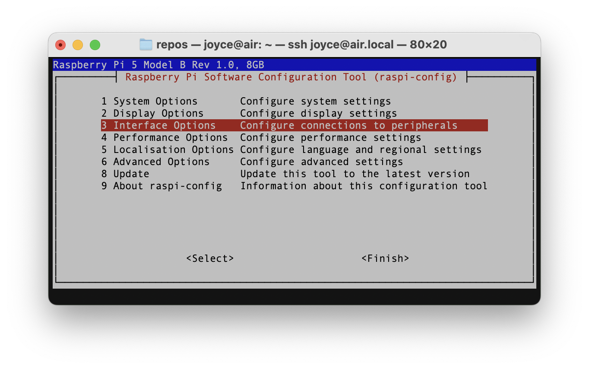
1. [Enable the relevant protocols](https://docs.viam.com/installation/prepare/rpi-setup/#enable-communication-protocols) to support our hardware. Since you are using a sensor that communicates over the serial port, enable **Serial Port**.
  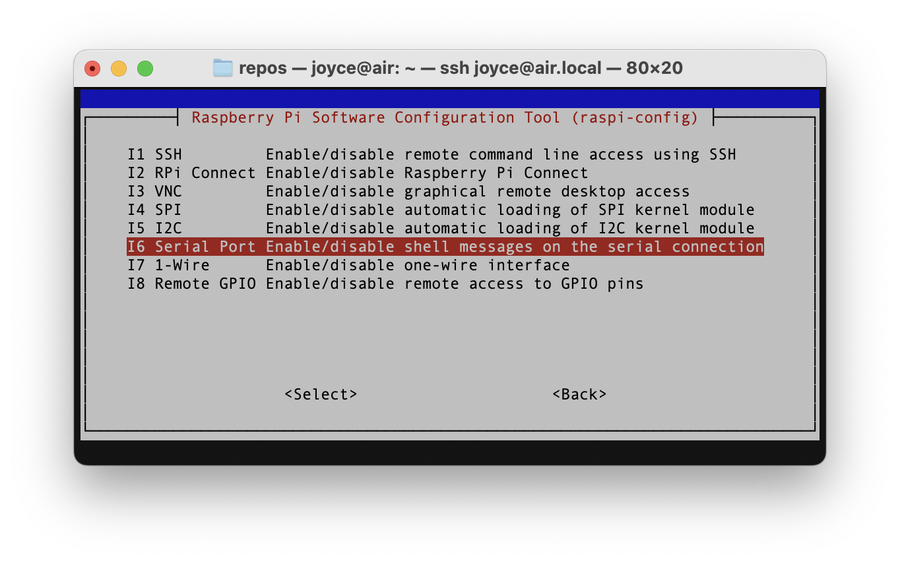
1. Confirm the options to enable the serial login shell and serial interface. And reboot the Pi when you're finished.

<!-- ------------------------ -->
## Configure your machine and peripherals
Duration: 5

### Configure your machine

1. In [the Viam app](https://app.viam.com/robots), create a machine by typing in a name and clicking **Add machine**. 
  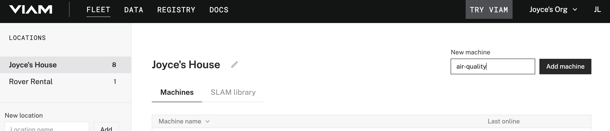
1. Click **View setup instructions**.
  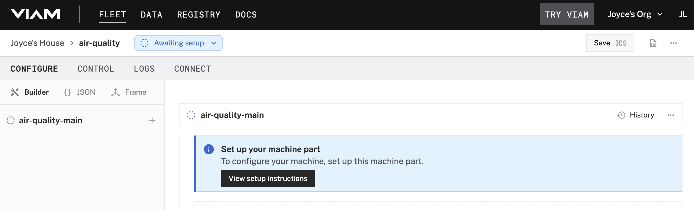
1. Install `viam-server` on the Raspberry Pi device that you want to use to communicate with and control your air sensor. Select the `Linux / Aarch64` platform for the Raspberry Pi to control the air sensor, and leave your installation method as `viam-agent`.
  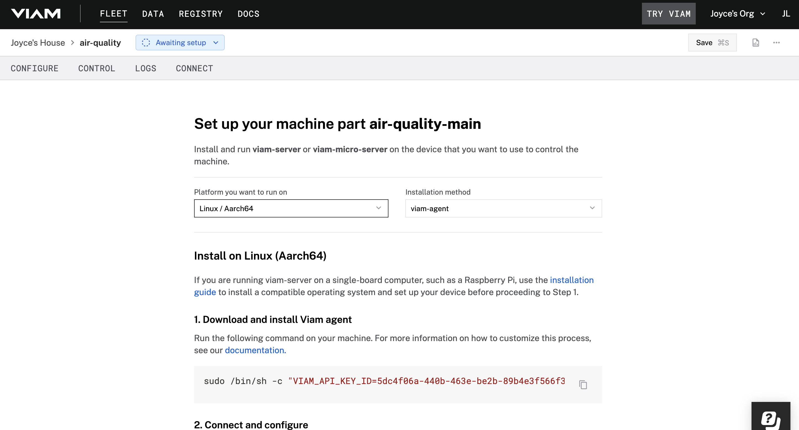
1. Use the `viam-agent` to download and install `viam-server` on your Raspberry Pi. Follow the instructions to run the command provided in the setup instructions from the SSH prompt of your Raspberry Pi.
  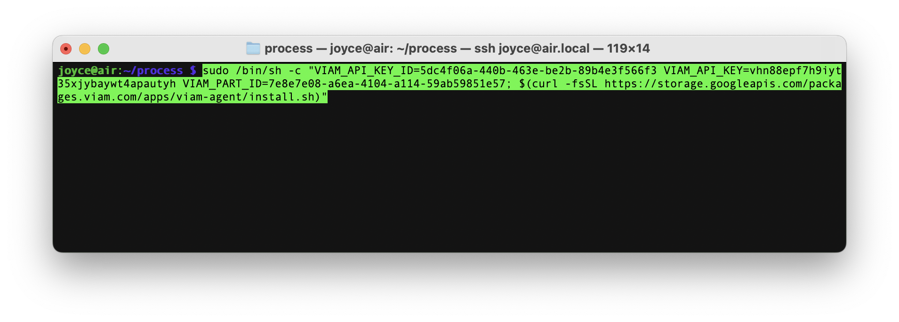
  The setup page will indicate when the machine is successfully connected. 

### Add your Raspberry Pi
1. In [the Viam app](https://app.viam.com/robots), find the **CONFIGURE** tab. It's time to configure your hardware.
1. Click the **+** icon in the left-hand menu and select **Component**. 
  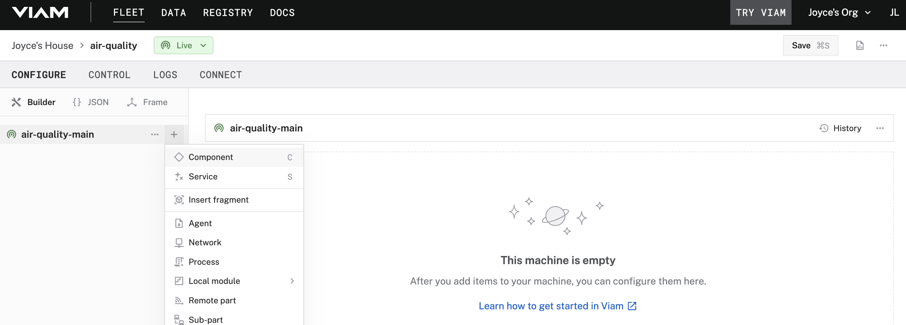
1. Select `board`, and find the `pi5` module. This adds the module for working with the Raspberry Pi 5's GPIO pins. Leave the default name `board-1` for now.
1. Notice adding this module adds the board hardware component called `board-1`. The collapsible card on the right corresponds to the part listed in the left sidebar. 
  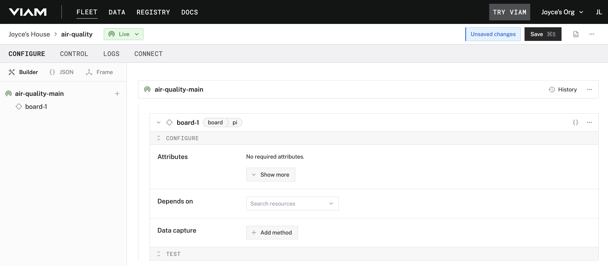
1. Click **Save** in the top right to save and apply your configuration changes.
    > aside negative
    > If any problems occur, check under the **LOGS** tab to see what might be going wrong.

### Add your air sensor

1. In [the Viam app](https://app.viam.com/robots), click the **+** icon and select **Component**. Select `sensor`, find the `air:pms7003` module, and click **Add module**. This module provides the sensor model that supports the specific hardware we are using for this tutorial. Leave the default name `sensor-1` for now.
  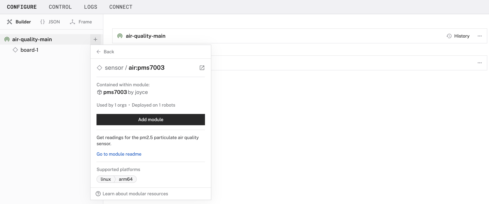
1. Notice adding this module adds the sensor hardware component called `sensor-1` as well as a module called `pms7003` which contains the logic for how our Raspberry Pi and air sensor work with each other. 
  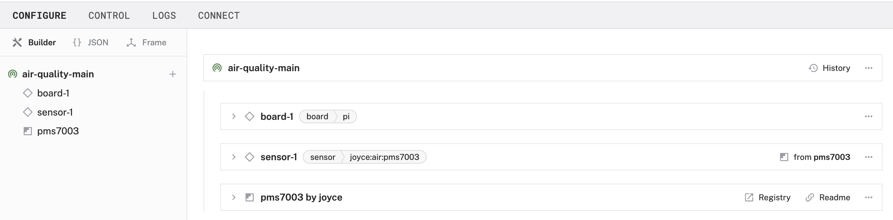
1. **Save** your updates.

### Add your smart plug

1. In [the Viam app](https://app.viam.com/robots), let's configure the rest of our hardware so that your machine can communicate with the smart plug over wifi. Click the **+** icon in the left-hand menu and select **Component**. Select `generic`, and find the `kasa:switch` module. This is a generic module that's been configured to use the `python-kasa` library. In other words, it's a layer of abstraction that lets us use the Kasa manufacturer's APIs with Viam.
  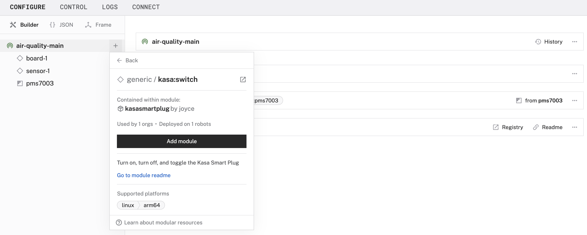
1. Notice adding this module adds the generic hardware component called `generic-1` as well as a module called `kasasmartplug` which contains the logic for how our Raspberry Pi and smart plug work with each other. 
1. Under the CONFIGURE section of the `generic-1` card, add your own smart plug's IP address that you found in a previous step, formatted like the following.
    ```json
    {
      "plug_ip": "192.168.1.169"
    }
    ```
    
1. **Save** your updates.

<!-- ------------------------ -->
## Test the hardware
Duration: 5

### Test the air sensor

1. In [the Viam app](https://app.viam.com/robots) under the **CONTROL** tab, you can see two hardware components called `generic-1` and `sensor-1`. They are your smart plug and air sensor that you configured on the **CONFIGURE** tab.
  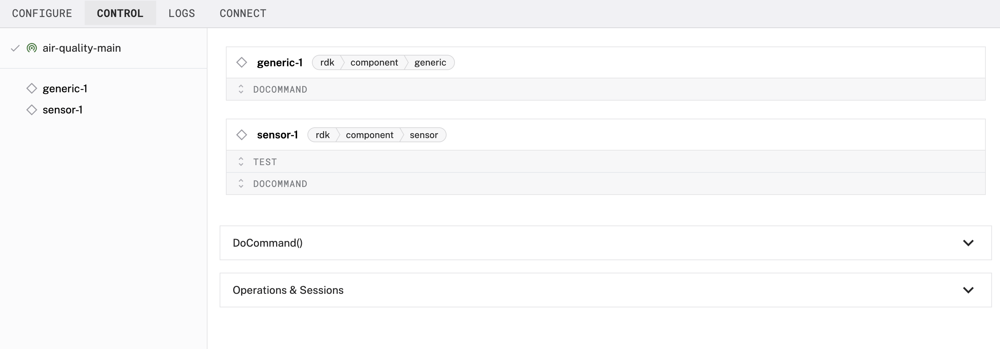
1. Find the `sensor-1` card, and expand the TEST accordion. The module we added has a `GetReadings` function to get the readings from our air sensor. Select `Manual refresh`, and then click the refresh icon to manually get the readings.
  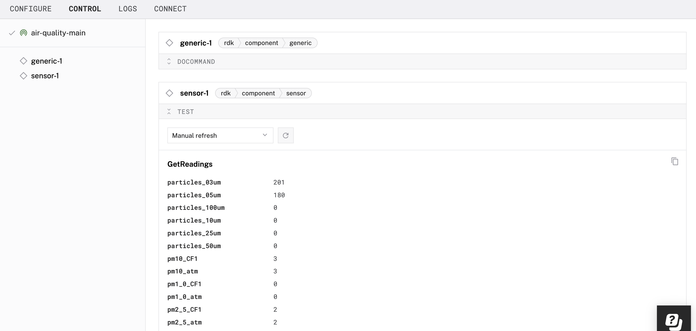
    > aside negative
    > If any problems occur, check under the **LOGS** tab to see what might be going wrong.
    
    > aside positive
    > If you're curious about what these values mean, refer to the U.S. Environmental Protection Agency's [basics on particulate matter (PM)](https://www.epa.gov/pm-pollution/particulate-matter-pm-basics). For measuring the [indoor air quality](https://www.epa.gov/indoor-air-quality-iaq/indoor-pollutants-and-sources) in your home, we'll be looking at PM2.5, a very small particle size.

### Test the smart plug

1. Next, test that your smart plug is working properly. Make sure the fan is still plugged in to the powered smart plug. Also make sure the fan knob is set to on. 
1. In [the Viam app](https://app.viam.com/robots) under the **CONTROL** tab, find the `generic-1` card, and expand the DOCOMMAND accordion. The module we added has a few functions to control the smart plug. Under the **Input** section, add the following JSON object (if your fan is still running), and then click **Execute** to toggle off the smart plug.
    ```json
    {
      "toggle_off": []
    }
    ```
    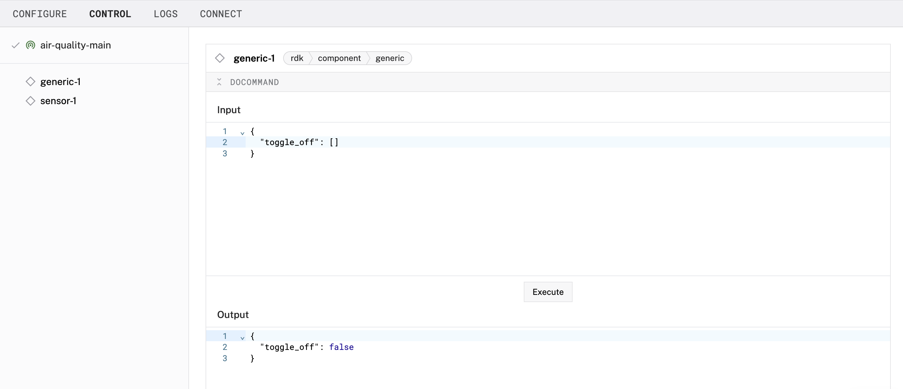
1. Now update `"toggle_off"` to `"toggle_on"` in the JSON object, and **Execute** once again.
1. From [the module listing in the registry](https://app.viam.com/module/joyce/kasasmartplug), you may be able to refer to additional documentation in [the module's README](https://github.com/loopDelicious/viam-kasa-switch) to learn about other functions you can use to test your hardware.

<!-- ------------------------ -->
## Program your air monitoring device
Duration: 6

At this point, you have configured and tested your machine and peripherals, but nothing is happening automatically. In the next section, program your air monitoring device to be a little smarter. Make your machine periodically get readings, turn on the air filter if the values are high, and turn off again when the values are low.

### Create an automation script

1. To configure the machine to automatically run a command to execute a script, use a [Viam process](https://docs.viam.com/configure/processes/). Create a new file called `process.py`.
    ```bash
    $ touch process.py
    ```
1. Copy and paste [this sample code](https://github.com/loopDelicious/viam-pm25-process/blob/main/process.py) into the new file `process.py`. This code will allow your Raspberry Pi to connect to both our sensor and plug and execute our logic.
1. Now it's time to move your control code to your Raspberry Pi device. [SSH into your Raspberry Pi](https://docs.viam.com/installation/prepare/rpi-setup/#connect-with-ssh) if you're not already SSH'd.
1. From the SSH prompt on your Raspberry Pi, create a directory called `process` to hold your code. And then, change into that directory.
    ```bash
    $ mkdir process
    $ cd process
    ```
1. Install the Python package manager.
    ```bash
    $ sudo apt install python3-pip
    ```
1. Install the Viam Python SDK **into that new directory**.
    ```bash
    $ pip3 install --target=process viam-sdk
    ```
1. Display the full path of the current directory you are working in on your Raspberry Pi with the `pwd` command. Make a note of this output for the next steps.
    ```bash
    $ pwd
    ```
1. Find the executable path of Python3 to run `process.py` on your Raspberry Pi with `which Python3`. Again, make a note of this output for the next steps.
    ```bash
    $ which Python3
    ```
1. Run the following command from your computer (not the SSH prompt to your Raspberry Pi) to copy the code from your computer to your Raspberry Pi. In the command, you will copy `process.py` over to your Raspberry Pi, with the section following the colon `:` indicating where your file should be copied to on the Raspberry Pi (the path of the directory you are working in on your Raspberry Pi, along with the filename). 
    ```bash
    $ scp process.py user@host.local:/home/myboard/process/process.py
    ```

### Configure a Viam process

1. Now let's allow `viam-server` to run the process as the root user on your Raspberry Pi by configuring a [Viam process](https://docs.viam.com/configure/processes/). In [the Viam app](https://app.viam.com/robots) under the **CONFIGURE** tab, click the **+** icon in the left-hand menu and select **Process**. 
1. Find the corresponding card to `process-1`. Enter the executable path of Python3 running on your Raspberry Pi that you output from a previous step. Add an argument of the `process.py` file to run on your Raspberry Pi. Enter the working directory where you want the process to execute.
  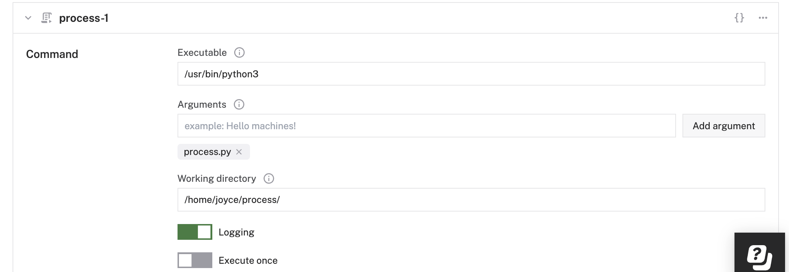
1. Still within the `process-1` card, select the advanced settings icon near the top right corner to review the configuration JSON. Create a new `env` property, and add your environment variables within the new property, formatted like the following with your own credentials. 
    ```json
      "env": {
        "SENSOR_NAME": "sensor-1",
        "PLUG_NAME": "generic-1",
        "ROBOT_API_KEY": "your-api-key",
        "ROBOT_API_KEY_ID": "your-api-key-id",
        "ROBOT_ADDRESS": "your-robot-address"
      },
    ```
    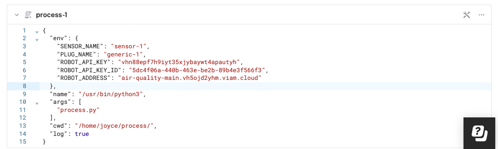
    > aside negative
    > The `SENSOR_NAME` and `PLUG_NAME` are the default names for our air sensor and smart plug when added to our Viam machine. Other machine credentials can be found under the **CONNECT** tab, selecting an SDK, and toggling **Include API key** to reveal your credentials within the code sample.
        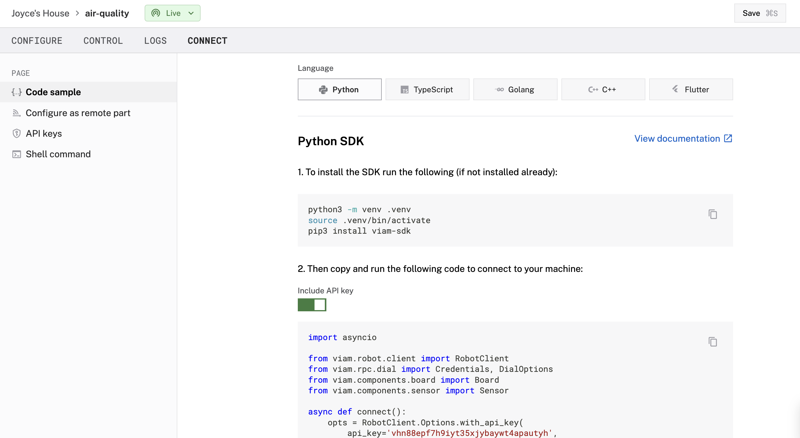
1. **Save** your updates.
1. Restart the machine.
    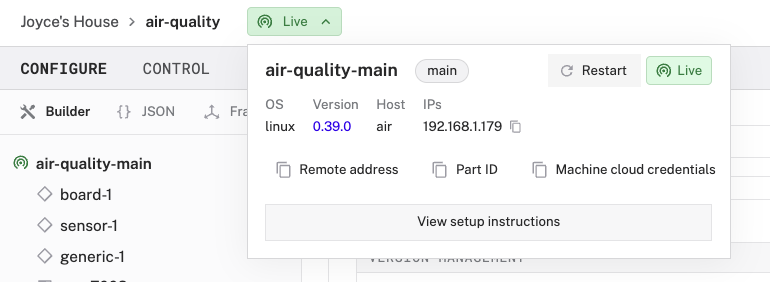
1. You can test the code by updating the `process.py` file on your Raspberry Pi to update the `do_command` when thresholds are low from `toggle_off` to `toggle_on`. **Save** your code changes, and restart the machine to see if the fan turns on when the air quality is healthy.
    > aside negative
    > You can either edit the file on your computer and copy the updated file over to your Raspberry Pi using `scp` like we did previously. Or you can use the default command-line text editor on Raspberry Pi OS `nano` by entering `nano process.py` from the SSH prompt. 
    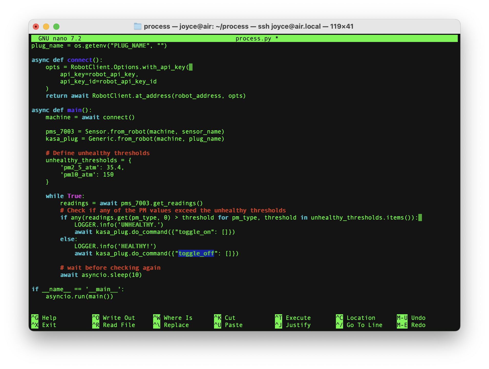
    Alternatively, you can blow on the air sensor until the values rise above the threshold.

<!-- ------------------------ -->
## Finishing touches
Duration: 3

Now that your system is working the way you want it, it's time to tidy up our project so it's not a loose jumble of wires and parts.

1. 3D print (or buy) an enclosure for your Raspberry Pi and sensor. I found [an existing design that I liked](https://www.printables.com/model/742926-raspberry-pi-5-case) to fit a standard Raspberry Pi 5. Using a piece of heavy-duty velcro, I mounted the sensor on top to ensure the sensor could accurately measure the surrounding air. 
  
1. You might prefer to have the Raspberry Pi and air sensor within the same case. If you're planning to design your own enclosure, make sure the air sensor receives adequate ventilation and isn't placed too close to the Raspberry Pi chip, as it can get a bit hot.

<!-- ------------------------ -->
## Next Steps
Duration: 2

### Enhance your air filtration system
Now that you have created an air quality monitoring device with a smart plug, you can customize and make it your own. Suggestions for next steps include the following:

- **Improve the design**: Improve on the design of the air filter, like a [Corsi Rosenthal box](https://en.wikipedia.org/wiki/Corsi%E2%80%93Rosenthal_Box).
- **Modify the sensing**: Swap out the sensor to one that detects temperature or humidity.
- **Modify the actuation**: Swap out the actuation mechanism to turn on a light or trigger a notification. 

### Create an army of air sensors

You can scale up your air monitoring system by creating air sensors in different rooms or different locations, like in this tutorial to [Monitor Air Quality with a Fleet of Sensors](https://docs.viam.com/tutorials/control/air-quality-fleet/).

- **Sensor fusion**: Collect and aggregate data from different types of sensors to specify the precise conditions that trigger the actuation using [Viam data management and machine learning](https://docs.viam.com/tutorials/services/data-mlmodel-tutorial/).
- **Build a mobile app**: Use [Viam’s SDK libraries](https://docs.viam.com/sdks/) to build a Flutter mobile app or TypeScript web app.

### What You Learned
- how to use modules from the Viam registry
- how to set up a continuously running process on a Viam machine
- how to use variables on your Viam machine
- how to move control code to your machine

### Related Resources
- VIDEO
- Learn how to [create and deploy a new module](https://docs.viam.com/how-tos/create-module/)
- [Monitor Air Quality with a Fleet of Sensors](https://docs.viam.com/tutorials/control/air-quality-fleet/) tutorial
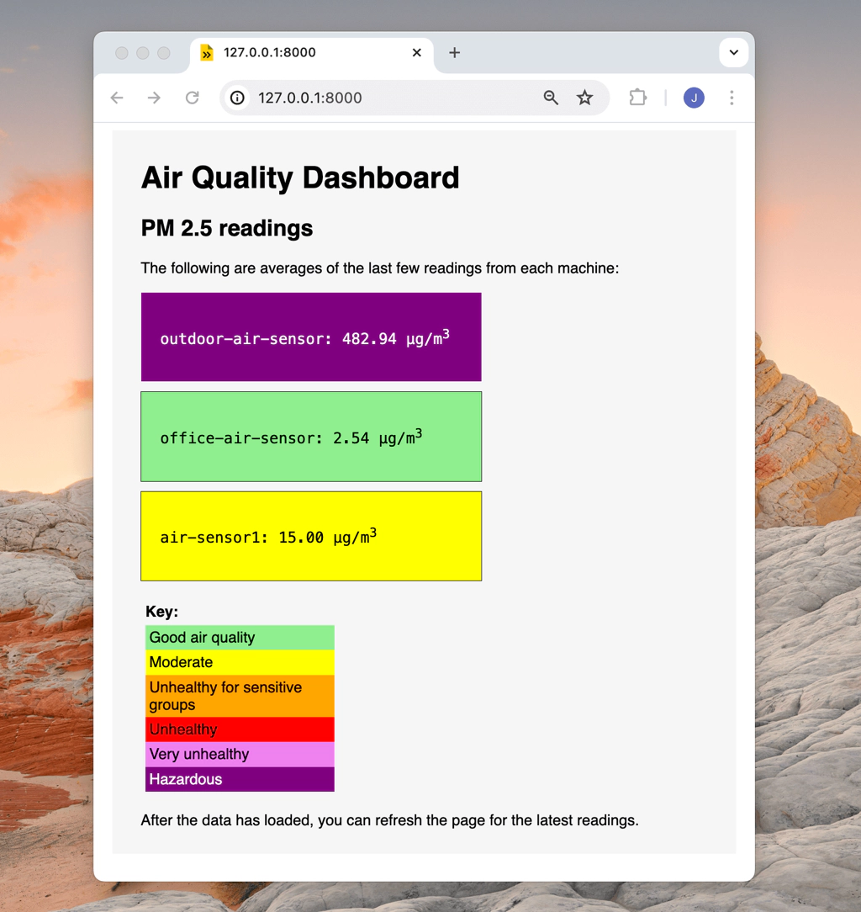