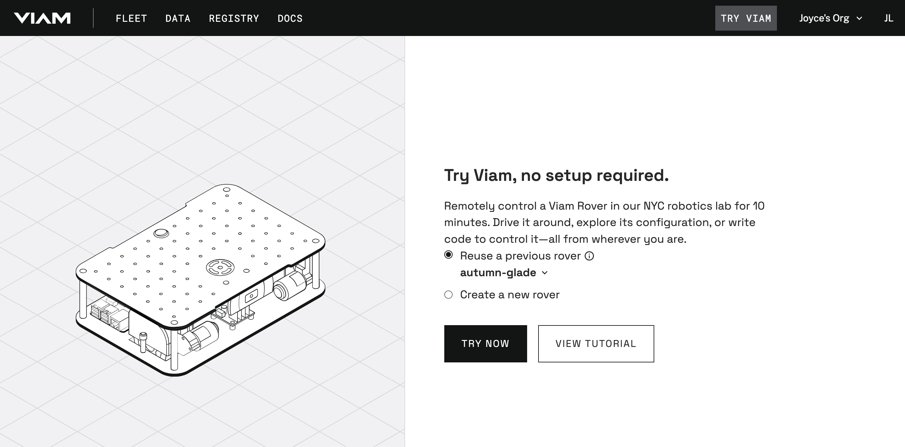
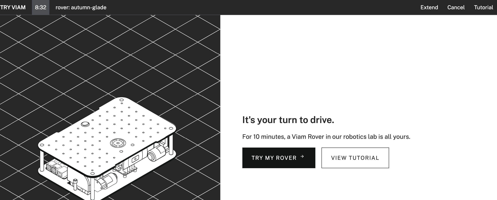
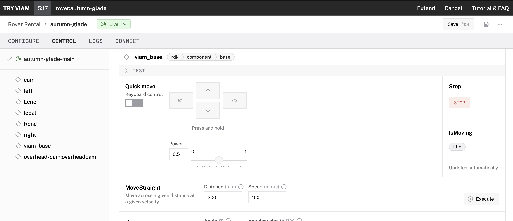
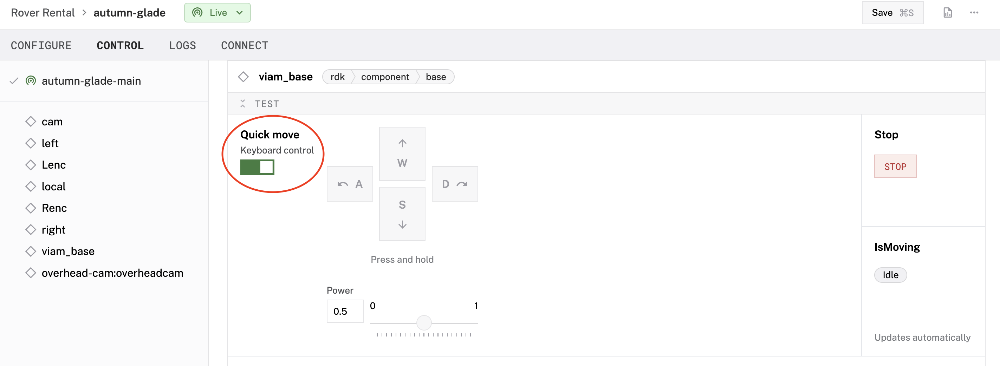
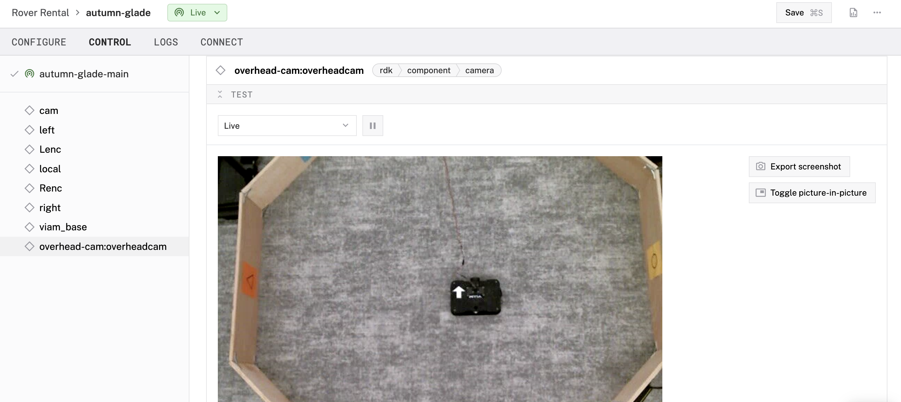
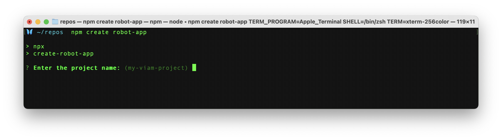
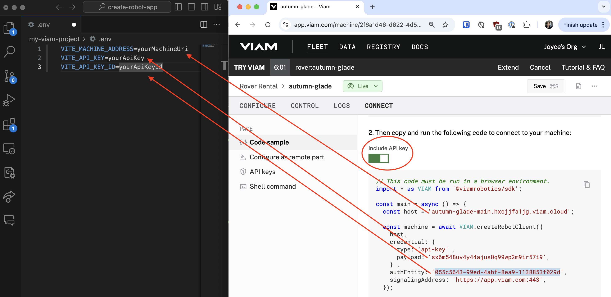
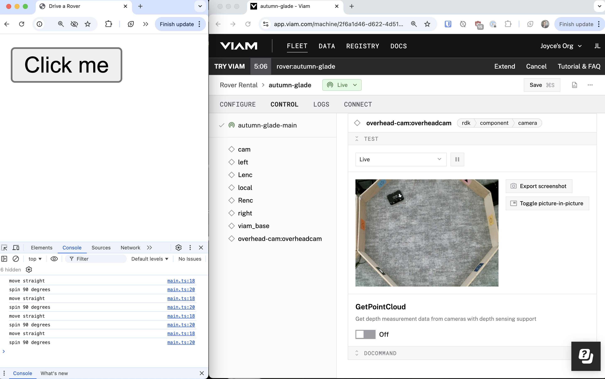

author: Joyce
id: drive-rover-ts
summary: Demo of Viam TypScript SDK to drive a rover in a square
categories: Developer, Getting-Started, Demos
environments: web
status: Published
feedback link: https://github.com/viam-labs/viamcodelabs/issues
tags: Getting Started, Developer, Demos

# Drive a rover using TypeScript

<!-- ------------------------ -->

## Overview

Duration: 1

Drive a rover in a square using the Viam TypeScript SDK.

### Prerequisites

- Sign up for a free Viam account, and then [sign in](https://app.viam.com/robots/) to the Viam app

### What You’ll Learn

- How to drive a rover in a square using the Viam TypeScript SDK
- How to use environment variables with your Viam machine

### What You’ll Need

- A Linux, macOS or Windows computer that can run SDK code
- [VS Code](https://code.visualstudio.com/download) installed, or your preferred code editor
- [Node](https://www.python.org/downloads/) installed

### What You’ll Build

- A working demo of a TypeScript application to control a machine in Viam.

### Watch the Video

Follow along with the step-by-step video.

<video id="VrVqYuKx9ro"></video>

<!-- ------------------------ -->

## Borrow a Viam rover

Duration: 2

1. Go to [Try Viam](https://app.viam.com/try) in your web browser to remotely control a rover pre-configured with components in the NYC Viam robotics lab. This may take up to 30 seconds.
   
   > aside negative
   > You can also use [your own Viam rover](https://docs.viam.com/appendix/try-viam/rover-resources/) or another wheeled robot.

1. Once your rover is configured and online, click **Try My Rover**.
   
1. Under the **CONFIGURE** tab, review the configuration details. Notice the components in the left sidebar, such as the `viam_base` and `overhead-camera`.
1. Find the **CONTROL** tab. This is where you can control your Viam rover. Find the `viam_base` in the left sidebar, and click on it. Notice the components in the left sidebar correspond to a more detailed view on the right side of the page.
   
1. Within the `viam_base` card, toggle on the **Keyboard control** so that you can control the rover using keyboard keys **WASD**.
   
1. To see the rover move, find the `overhead-cam`. Select **Live** from the dropdown options to see a live feed of the rover in the robotics lab. And then use the **WASD** keys to control the rover in real-time.
   

If you want more time to keep playing with your borrowed rover, hit the **Extend** button in the top right of the page.

<!-- ------------------------ -->

## Control your rover with TypeScript

Duration: 2

Now that you know how to manually control the rover using the Viam app, let's control the rover programmatically with code.

1. From the command line within your terminal window, let's use a command line utility to quickly set up a new TypeScript project. Input the following command:
    ```bash
    $ npm create robot-app
    ```
1. At the command-line prompt, input your project name. Or hit **Enter** to accept the default project name, `my-viam-project`.
   
1. Once the project setup is completed, follow the command-line instructions. Navigate into your new project directory. In the example shown below, we are using the default project name `my-viam-project`.
    ```bash
    $ cd my-viam-project
    ```
1. In the Viam app, find the **CONNECT** page, select the **TypeScript** SDK, and turn on **Include API key** to reveal your machine credentials within the code sample. Use these machine credentials to update the `.env` file in your new project directory, and save your changes.
   
1. Start the application server. Your web app should be running at `http://localhost:5173/`
    ```bash
    $ npm start
    ```
1. Open your browser's devtools, for example, by right-clicking and selecting **Inspect**, to see the browser's console logs. And position the browser window so you can once again see the `overhead-cam` in the CONTROL tab within the Viam app. Press the **Click me** button in the web application to see the console logs and camera feed of the rover in the robotics lab at the same time.
   
1. In your IDE, edit `src/main.ts` to change the logic being run. Edit `index.html` to change the layout of the web application.

<!-- ------------------------ -->

## Next Steps

Duration: 2

> aside negative
> If you want more time to keep playing with your borrowed rover, hit the **Extend** button in the top right of the page.

### What You Learned
- How to drive a rover in a square using the Viam TypeScript SDK
- How to use environment variables with your Viam machine

### Related Resources
- [Detect people with a webcam](https://docs.viam.com/get-started/detect-people/): use the borrowed rover's webcam or the webcam on your own laptop to deploy and use a machine learning model with a vision service
- Explore other [Viam SDK libraries](https://docs.viam.com/sdks/), besides TypeScript for backend, frontend, and mobile development.
