author: Joyce
id: environment-variables
summary: Use Python environment variables in development and in production
categories: Getting-Started, Developer
environments: web
status: Published 
feedback link: https://github.com/viam-labs/viamcodelabs/issues
tags: Getting Started, Developer

# Working with Python environment variables
<!-- ------------------------ -->
## Overview 
Duration: 2

Environment variables can be used to configure dynamic requirements within an application. And they can be used to store sensitive information like API keys, machine credentials, and encryption secrets. 

In development, it's important to protect this sensitive data from being exposed in code repositories or logs. In production, security is even more critical to prevent unauthorized data leakages and breaches. 

In this codelab, let's learn how to use environment variables in Python with our Viam projects so our code runs smoothly from development to deployment.

### Prerequisites

- Sign up for a free Viam account, and then [sign in](https://app.viam.com/robots/) to the Viam app.

### What You’ll Learn

- How to create a Python virtual environment
- How to store and reuse values as environment variables in Python
- How to move control code to your machine
- How to use environment variables during development and in production

### What You’ll Need

- A computer with MacOS, Windows, or Linux 
- [Python3](https://www.python.org/downloads/) installed on your computer
- [VS Code](https://code.visualstudio.com/download) installed, or another similar code editor of your choice.

### What You'll Build

- An example project, such as a Viam rover, using Python variables to access our machine in Viam.

<!-- ------------------------ -->
## Set up a machine for local development
Duration: 2

### Borrow a rover online with Try Viam

> aside positive
> Skip this step if you already have a machine set up in Viam, and want to use variables within your own project.

1. **Borrow a Viam rover**: Let's use [Try Viam](https://app.viam.com/try) to borrow a rover online at no cost which is already configured with all the components you need. If you want to use your own wheeled robot, see more details in [this tutorial](https://docs.viam.com/get-started/drive-rover/).
 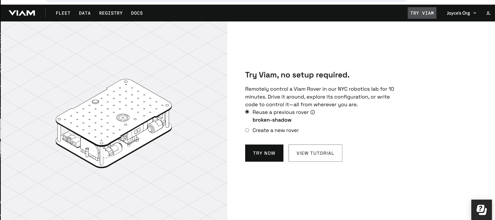
1. Once the rover is configured, click **Try Viam Now**.
 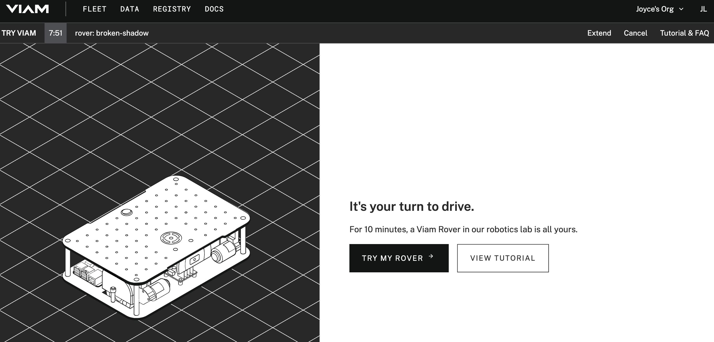
1. Examine the modular resources that make up the machine in the Viam app listed in the left sidebar of the **CONFIGURE** and **CONTROL** tabs.
 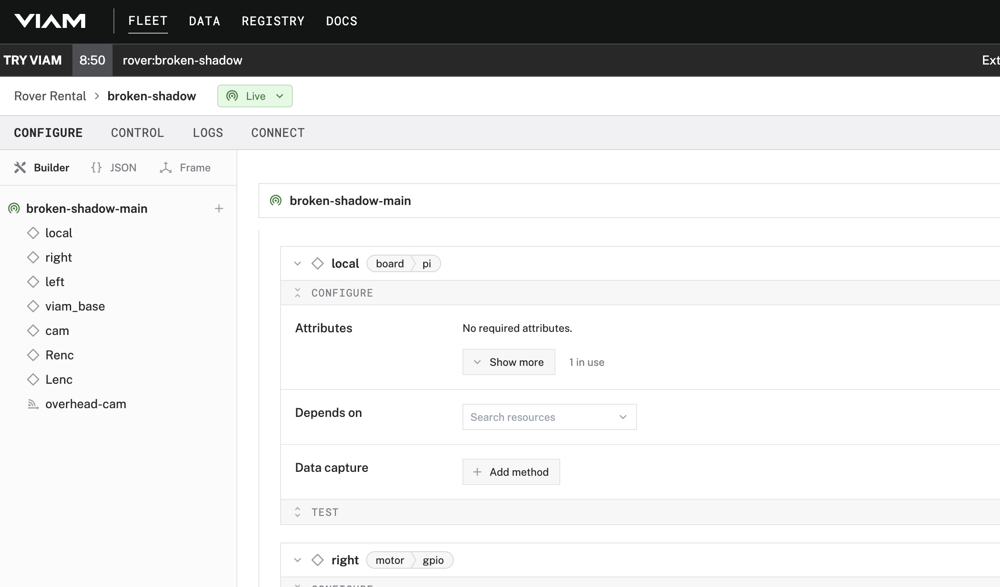

<!-- ------------------------ -->
## Prepare a virtual environment
Duration: 2

### Prepare a project directory

1. **Set up your project directory**: From the command line in your terminal window, make a directory for your project, for example, called `viam-rover`. And navigate into the directory.
    ```bash
    mkdir viam-rover
    cd viam-rover
    ```

### Prepare a virtual environment
[Set up a Python virtual environment](https://docs.viam.com/sdks/python/python-venv/) to avoid any conflicts with other projects or your system.
1. From the command line in your terminal window, install [`virtualenv` using `pip`](https://virtualenv.pypa.io/en/latest/installation.html#via-pip)
    ```bash
    python3 -m pip install --user virtualenv
    ```
1. **Create and activate a virtual environment**: In the project directory `viam-rover`, create and activate a virtual environment called `.venv` for Python to run in.
    ```bash
    python3 -m venv .venv
    source .venv/bin/activate
    ```
Now, `.venv` prepends the commands in your terminal window to indicate the Python packages being used are from this particular environment. You can exit this environment by running `deactivate`.

### Install the Python SDK

Install the Viam Python SDK and all required general dependencies.

1. **Install the SDK**: From the command line in your terminal window (inside the activated `.venv` Python environment), install the Viam Python SDK:
    ```bash
    pip install viam-sdk
    ```

    > aside negative
    > Windows is not supported. If you are using Windows, use the [Windows Subsystem for Linux (WSL)](https://learn.microsoft.com/en-us/windows/wsl/install) and install the Python SDK using the preceding instructions for Linux. For other unsupported systems, see [Installing from source](https://python.viam.dev/#installing-from-source).

<!-- ------------------------ -->
## Using variables in local development
Duration: 5

### Copy the sample code
1. **Refer to Python sample code**: In the Viam app, go to the **CONNECT** tab, and select **Python**. 
  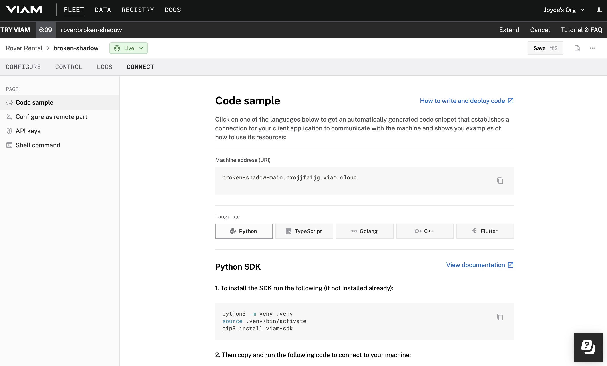
1. **Show secrets**: The sample code shows you how to authenticate and connect to a machine, as well as some of the methods you can use on your configured components and services. To show your machine’s API key and API key ID in the sample code, toggle **Include secret** on the CONNECT tab’s Code sample page. 
  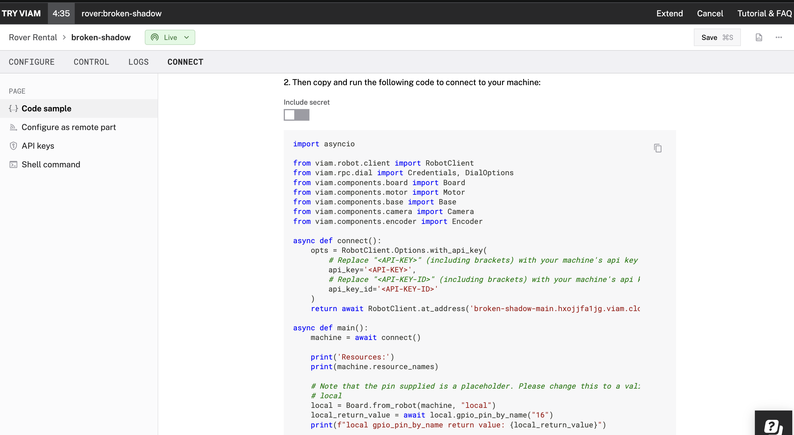
1. **Hide secrets**: Instead of leaving our sensitive credentials hard coded in this code sample, let's set up our API key and API key ID as environment variables. Toggle **Include secrets** once again, this time to remove the credentials from the code sample. 
1. **Create the code file**: From the command line in your terminal window, create a new file called `rover.py`.
   ```bash
   touch rover.py
   ```
1. **Paste the code sample**: Copy and paste the code sample from the Viam app into this new file `rover.py`.
### Run the sample code
1. **Create `.env` file**: From the command line, create a new file called `.env` to store our environment variables to use in local development.
    ```bash
    touch .env
    ```
1. **Input environment variables**: Add your own environment variables to the `.env` file, formatted like the following. Make sure to update the values with your own environment variables from the code sample in the Viam app, placed between the double quotes as shown here. 
    ```
    ROBOT_API_KEY="sijdb24bjnxsmp18mij0hace6smihu0r"
    ROBOT_API_KEY_ID="9e135013-f3bf-40fc-a0e3-e6fc66a418d7"
    ```
1. **Install `python-dotenv` package**: From the command line, still within our virtual environment `.venv`, install the [`python-dotenv`](https://pypi.org/project/python-dotenv/) package to read key-value pairs from an `.env `file and can set them as environment variables.
    ```bash
    pip install python-dotenv
   ```
1. **Load the variables into your environment**: At the top of your `rover.py` file, add the following code to load variables into your environment.
    ```python
    from dotenv import load_dotenv
    import os

    load_dotenv()  # Loads the environment variables from the .env file

    ROBOT_API_KEY = os.getenv('ROBOT_API_KEY')
    ROBOT_API_KEY_ID = os.getenv('ROBOT_API_KEY_ID')
    ```
1. **Use variables in your code**: You can now use these variables within your code. On rows 7 and 8 in `rover.py`, you load values from outside of your code (your environment) into python variables. And then on rows 20 and 21, you use those variables to access your machine.
  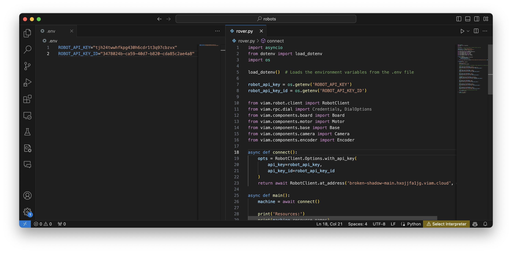
1. **Run the code:** Run the sample code to connect to your machine, and inspect the output.
   ```bash
   python rover.py
   ```
  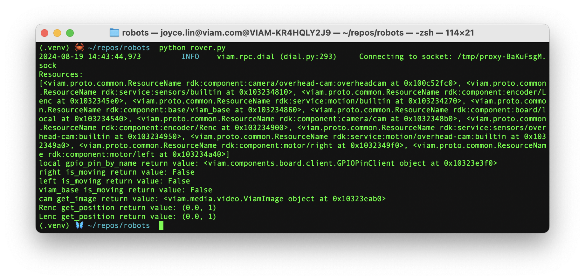

> aside positive
> If you want to play with the rover, go to the Viam app **CONTROL** tab to interact with your machine’s resources. Click on one of the camera panels and toggle the camera stream on so you can observe the rover’s movements. Or try adding more code to [drive the rover in a square](https://docs.viam.com/get-started/drive-rover/).

In the next few sections, learn how to use variables on your machine in production.

<!-- ------------------------ -->
## Add the control code to your machine
Duration: 3

Once you have the code working in your local development environment, you may choose to move your control code to your machine, so that it can run in production. 

> aside positive
> If you followed [Try Viam](https://app.viam.com/try), you won't have access to add control code to the machine, since you are just borrowing the rover. However, you can skip to the next part to see how you can set up variables on the machine. If you're using your own wheeled robot, you can complete these steps.

### Add the control code to your machine
1. **SSH into your board**: From the terminal window, run the following command to [SSH (Secure Shell) into your board](https://docs.viam.com/installation/prepare/rpi-setup/#connect-with-ssh), where the text in `<>` should be replaced (including the `<` and `>` symbols themselves) with the `user` and `hostname` you configured when you set up your machine. 
    ```bash
    ssh <USERNAME>@<REMOTE-HOSTNAME>.local
    ```
    > aside negative
    > On some networks, if the `hostname.local` alias fails to resolve, you can use the static IP address found in the Viam app status dropdown. For example, instead of `username@hostname.local`, you could use `username@192.168.2.197`.
      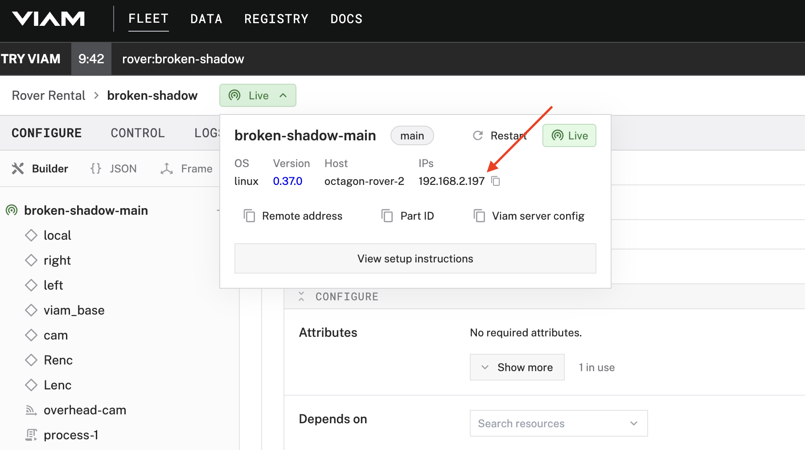
1. **Create a project directory**: Create a new directory on your machine to hold your project code.
    ```bash
    mkdir robot
    ```
1. **Create and activate a virtual environment**: In the new project directory `robot`, create and activate a virtual environment called `.venv` for Python to run in.
    ```bash
    python3 -m venv .venv
    source .venv/bin/activate
    ```
    Once again, `.venv` prepends the commands in your terminal window to indicate the Python packages being used are from this particular environment. You can exit this environment by running `deactivate`.
1. **Install dependencies**: Install the Viam Python SDK (and other dependencies if required) into the folder. 
    ```bash
    pip install viam-sdk
    ```
<!-- TODO do i need to activate a venv? -->
<!-- TODO do i need to chmod? -->
1. **Copy file(s) to the machine**: From the original computer you were developing on (not the secure shell prompt accessing your machine), copy the `rover.py` file to your machine.
    ```bash
    scp rover.py <USERNAME>@<REMOTE-HOSTNAME>.local:./robot/rover.py
    ```
1. **Add a process**: [Configure a process](https://docs.viam.com/configure/processes/#configure-a-process) by going to the **CONFIGURE** tab of the Viam app. Click the plus icon (**+**) next to your machine in the left-hand menu and select **Process**. Name your process `process-rover`.
  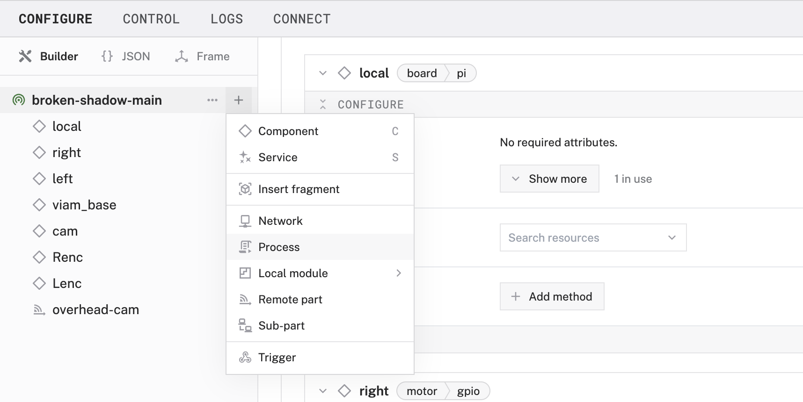
1. **Find executable path**: To find out the path of the Python 3 executable that is being used on your machine, you can input `which python3` in the command line from within your secure shell. You will need this output for the upcoming steps.
1. **Find file location**: To find the complete path of your `rover.py` file on your machine, navigate into the new `robot/` directory, and input `pwd` in the command line from within your secure shell. You will need this output for the next step.
1. **Configure the process**: Fill in the required fields to [configure your process](https://docs.viam.com/configure/processes/#configure-a-process) and **Save** in the upper right corner of the screen to save your config. The following example configuration executes the command `python3 rover.py` in your `home/myName/robot/` directory every time your machine boots, and keeps it executing indefinitely.
  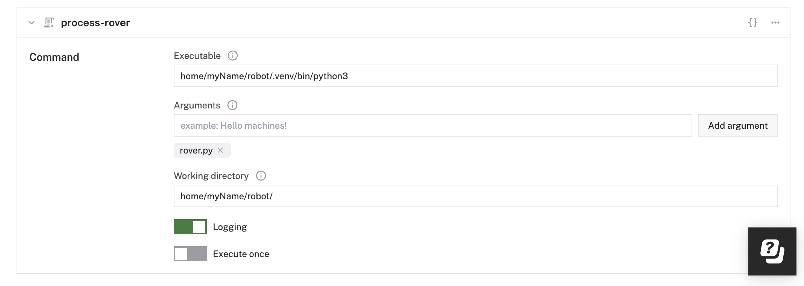

In our example, we added our code as a [process](https://docs.viam.com/configure/processes/), but you can also add control code to your machine as a [module](https://docs.viam.com/how-tos/create-module/).

<!-- ------------------------ -->
## Using environment variables on machine in production
Duration: 2

Now that you've moved your control code to your machine, let's set up our environment variables to use in production.

### Update the configuration JSON

1. **Locate the modular resource**: In the Viam app under the **CONFIGURE** tab, select the modular resource in the side bar to locate the card where we will add environment variables. At the top right of the card, select the curly braces icon to see advanced configuration details.
  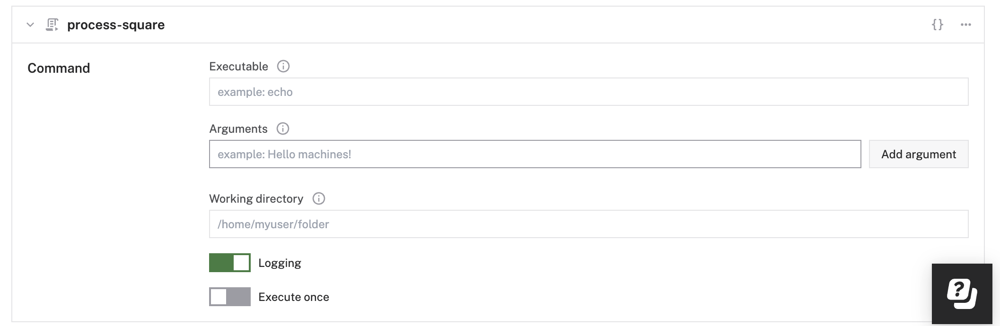
1. Add a new JSON property called `env` and your environment variables, formatted like the following.
  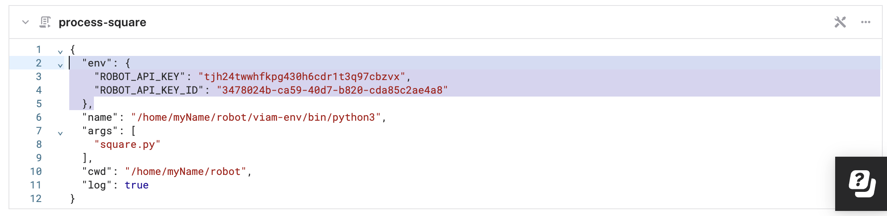
1. Save the changes at the top of the page, and restart the machine in the status dropdown at the top.
  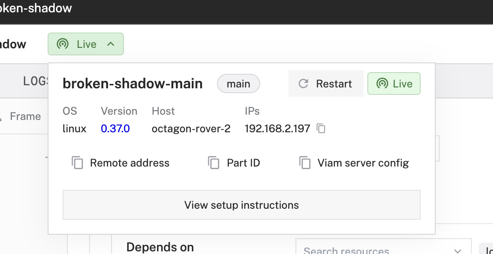

### Other ways to use variables 

This is the recommended approach to [using Viam environment variables within a a registry module](https://docs.viam.com/registry/configure/#use-environment-variables-with-a-registry-module), or other modular resources on a physical device. 

But there are other ways to use environment variables:

- **Add virtual environment**: If you're working with modules, you can add a Python virtual environment to a [persistent folder location](https://docs.viam.com/registry/configure/#default-environment-variables) set to the environment variable `VIAM_MODULE_DATA`, where a module can store data across reboots and versions, after the module is first installed.
- **Update root profile**: If you have administrative (root) privileges, you can add environment variables to your machine's root profile (not the user profile). You'll need to modify the global configuration files that affect all users on the system.
  - Linux and MacOS users can update a root profile like at `/etc/profile`, `/etc/bash.bashrc`, or `/etc/zsh/zshrc`
  - Windows users can update **System Properties** → **Environment Variables** to set system-wide variables.

<!-- ------------------------ -->
## Next Steps
Duration: 2

Knowing how to manage environment variables allows you to work more efficiently and keep your code DRY (Don't Repeat Yourself) for more maintainable, readable, and error free code. It's also important for security reasons not to leak sensitive data and risk access to secure systems.

### What You Learned

- How to use environment variables in local development
- How to use environment variables on machine in production

### Related Resources

- VIDEO
- Learn how [to create and deploy a new module](https://docs.viam.com/how-tos/create-module/)
<!-- - TODO GO variables? -->

