author: Joyce
id: install-esp32
summary: Instructions to install viam-micro-server on ESP32
categories: Getting-Started, Developer
environments: web
status: Published
feedback link: https://github.com/viam-labs/viamcodelabs/issues
tags: Getting Started, Developer, Data

# Install viam-micro-server on ESP32

<!-- ------------------------ -->

## Overview

Duration: 1

An ESP32 board is a lightweight, cost-effective solution for projects requiring basic control, real-time processing, and wireless communication. It's ideal for simpler robotics or IoT applications where the full power of a single-board computer (SBC) like a Raspberry Pi isn’t necessary.

Learn how to install the lightweight `viam-micro-server` which can run on resource-limited embedded systems, like the ESP32, that cannot run the fully-featured `viam-server`. The `viam-micro-server` is built from the [micro-RDK](https://github.com/viamrobotics/micro-rdk/tree/main).

> aside negative
> Refer to the [Viam installation guide](https://docs.viam.com/installation/) in the docs for the latest guidelines.

### Prerequisites

- Sign up for a free Viam account, and then [sign in](https://app.viam.com/robots/) to the Viam app

### What You’ll Learn

- How to install the `viam-micro-server` on a microcontroller

### What You’ll Need

- A computer running Mac, Windows, or Linux
- [ESP32 development board](https://www.amazon.com/FREENOVE-ESP32-WROVER-Compatible-Wireless-Detailed/dp/B0CJJHXD1W) - check the Viam docs for [specific resource requirements](https://docs.viam.com/installation/#compatibility)
- USB data cable - make sure the cable is capable of data transfer (not just charging); refer to this resource for [How To Tell If A USB Cable Is For Charging Or Data Transfer](https://glidedigital.com/how-to-tell-if-a-usb-cable-is-for-charging-or-data-transfer)

### What You’ll Build

- Flash a build of the `viam-micro-server`, along with your machine’s credentials and your wifi information, to your ESP32 development board. Then configure and control your ESP32 using Viam.

### Watch the Video

<!-- ------------------------ -->

## Install the viam-micro-server on ESP32

Duration: 5

1. Connect your ESP32 board to your computer with a data cable. Make sure the cable is capable of data transfer (not just charging).
1. In the [Viam app](https://app.viam.com/), enter a name for a new machine, and **Add machine**.
   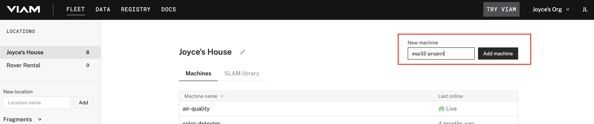
1. Under the **CONFIGURE** tab, click the **View setup instructions** button.
   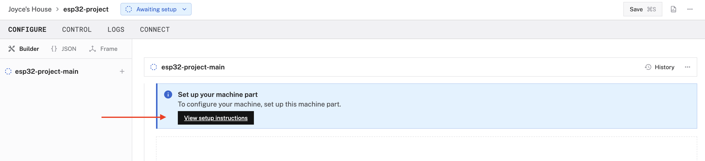
1. Select the platform you want to run on, ESP32.
   
1. Select the platform of the computer you're using to flash the ESP32. The example shown below will be for a Mac, but the steps to follow for other operating systems is similar.
   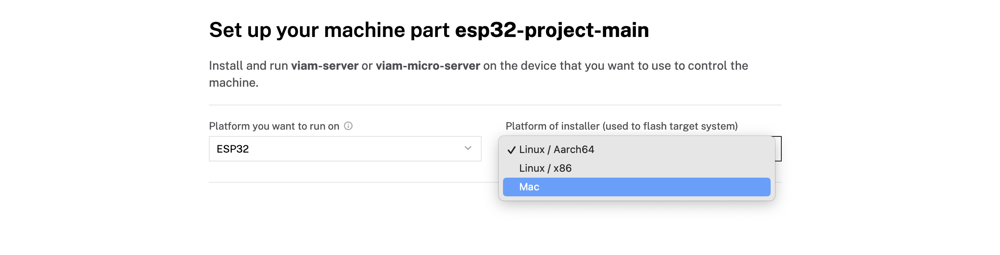
1. Download the file for the `viam-micro-server` installer used to flash and monitor logs on your ESP32.
1. Download the file for the machine credentials used to connect the ESP32 to the Viam app.
   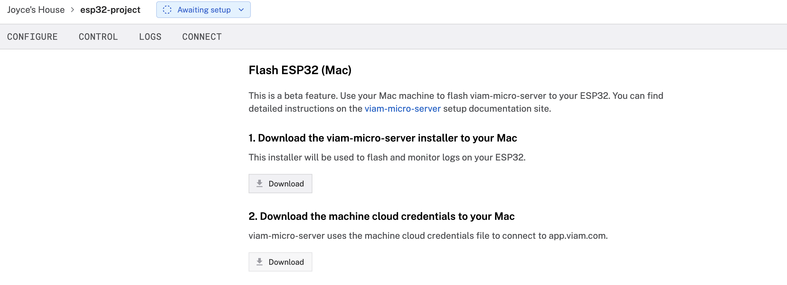
1. In the terminal window, navigate to the directory where the previous files downloaded. In the example shown below, files were downloaded to the `~/Downloads` directory of the computer.
   ```bash
   $ cd ~/Downloads
   ```
1. Copy the installation command from the setup instructions in the Viam app.
   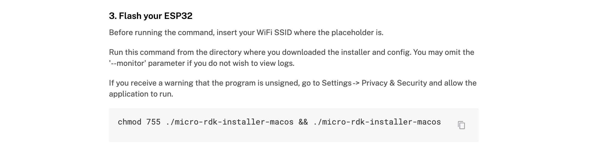
1. Paste it into your terminal window at the command line prompt. Replace the `&lt;WIFI-SSID&gt;` placeholder (including the angle brackets`<`and`>`) with your own SSID.
   ```bash
   $ chmod 755 ./micro-rdk-installer-macos && ./micro-rdk-installer-macos write-flash --app-config viam-esp32-project-main.json --monitor --wifi-ssid "<WIFI-SSID>"
   ```
   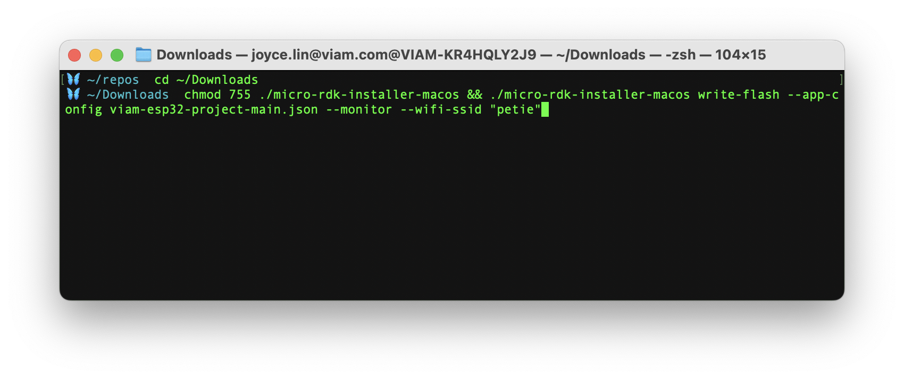
1. Run the command. Enter your WiFi password when prompted. If you receive a warning that the program is unsigned, go to Settings -> Privacy & Security and allow the application to run.
1. When prompted to select your connection type, select `/dev/cu.*`. In most cases, including flashing firmware on the ESP32, you’ll typically use `cu` (call-up) instead of `tty` (teletype).
   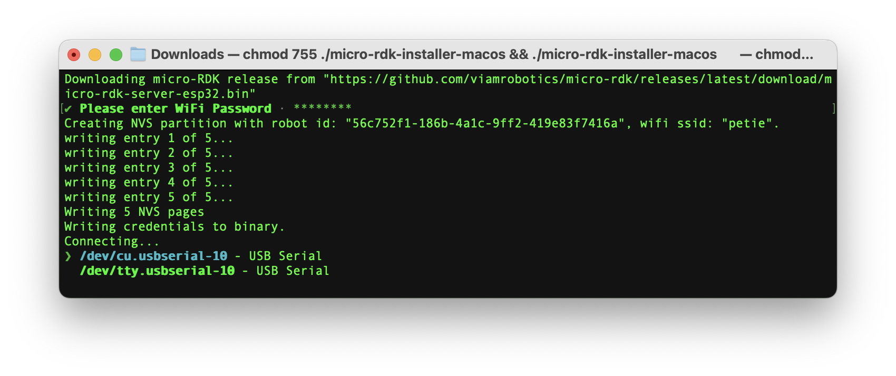
1. In the Viam app, wait for confirmation that your machine has successfully connected, and status is "Live". This might take a few minutes to complete depending on your connection.
   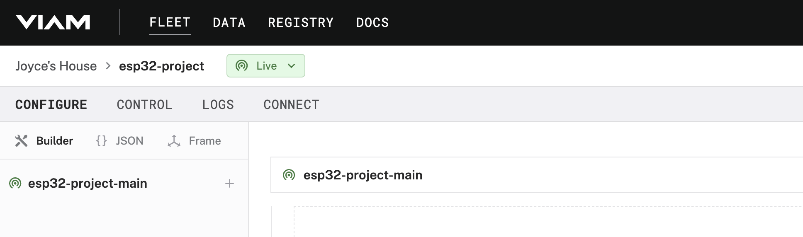
   > aside negative
   > Check out the [troubleshooting tips](https://docs.viam.com/installation/#troubleshooting) if you encounter any issues with the installation.

<!-- ------------------------ -->

## Configure and control the ESP32

Duration: 2

1. Once the machine is connected, you can begin adding resources to control. For example, under the **CONFIGURE** tab, click the **+** icon in the left-hand menu and select **Component**. Select `board`, and find the `esp32` module, and **Create**. This adds the module for working with the ESP32 board's GPIO pins. Leave the default name `board-1` for now.
   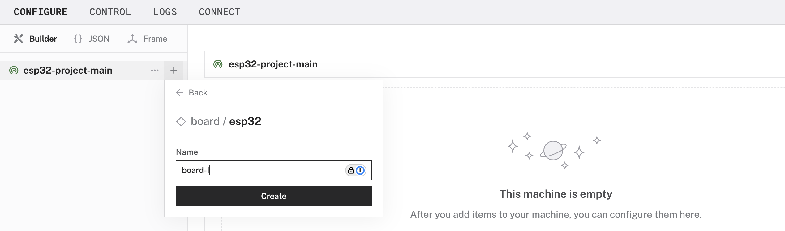
1. Notice adding this module adds the board hardware component called `board-1`. The collapsible card on the right corresponds to the part listed in the left sidebar.
   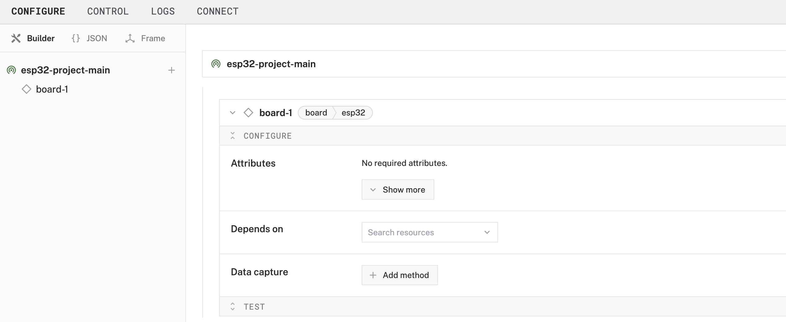
1. Within the `board-1` card, expand the **Attributes** dropdown to see options to configure the board. Input `12` and **Enter** to configure GPIO pin 12.
1. Click **Save** in the top right to save and apply your configuration changes.
1. Under the **CONTROL** tab, you can see one hardware component called `board-1` that you configured on the **CONFIGURE** tab. Enter `12` into the `Pin` field, select the **Read** mode, so you can `Get` information about that pin.
   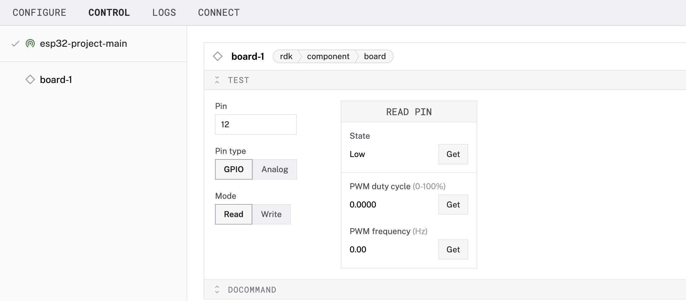
   > aside negative
   > If any problems occur as you're working, check under the **LOGS** tab to see what might be going wrong.

<!-- ------------------------ -->

## Next steps

Duration: 1

### What You Learned

- How to install the `viam-micro-server` on a microcontroller

### Develop custom firmware

Once `viam-micro-server` is installed, you can use your ESP32 with all of Viam's supported resource APIs, but you cannot write your own code directly interacting with the chip. If you want to program the chip directly, follow the [development setup guide](https://docs.viam.com/installation/viam-micro-server-dev/) to learn how to to customize `viam-micro-server` and create modules using Rust.

### Related projects

- [Configure an esp32-camera](https://docs.viam.com/components/camera/esp32-camera/) guide
- [Build a plant watering robot with webhooks and an ESP32](https://www.viam.com/post/build-a-plant-watering-robot-with-webhooks-and-an-esp32) tutorial

You can also learn how to [install `viam-server`](https://docs.viam.com/installation/#install-viam-server) on single-board computers and other devices.
