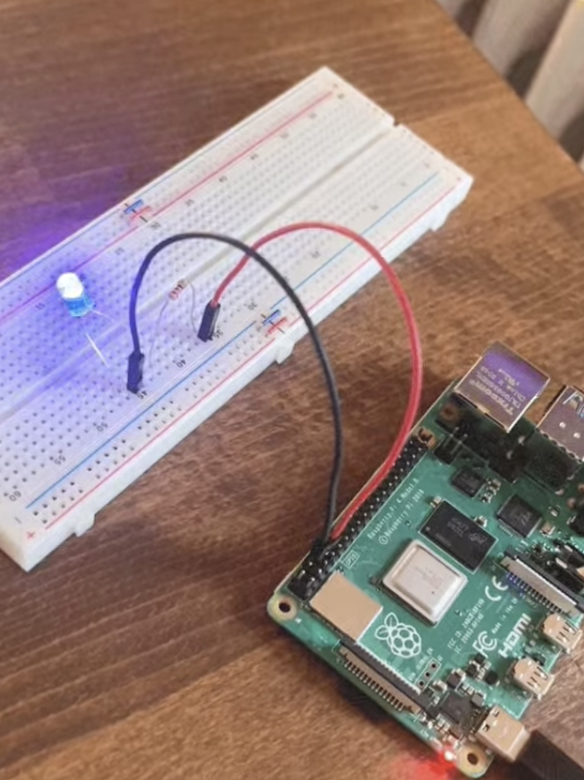
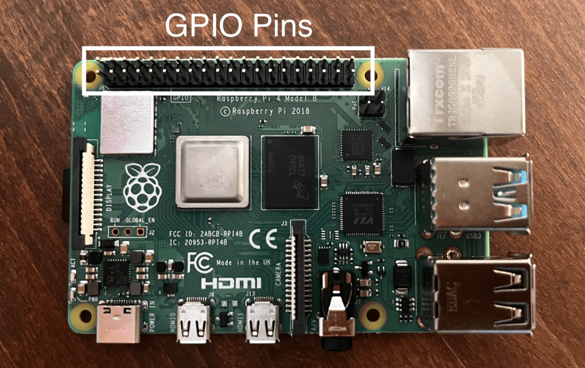
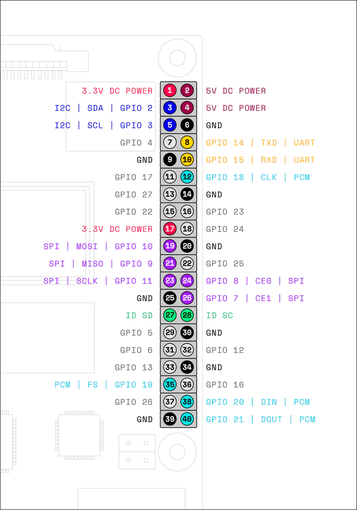
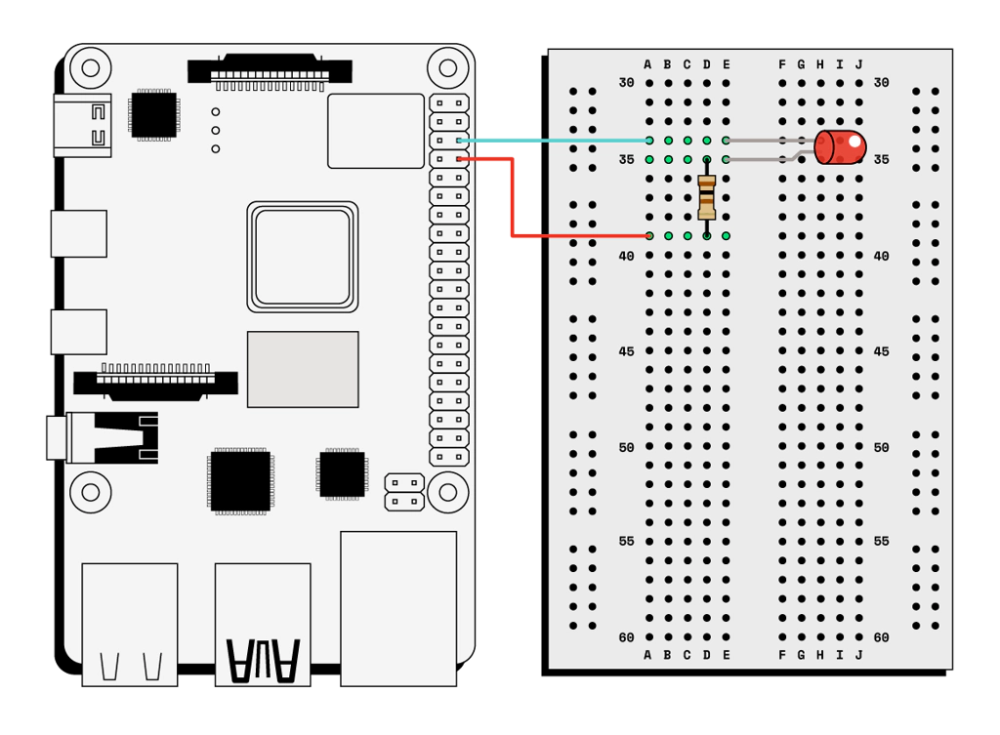
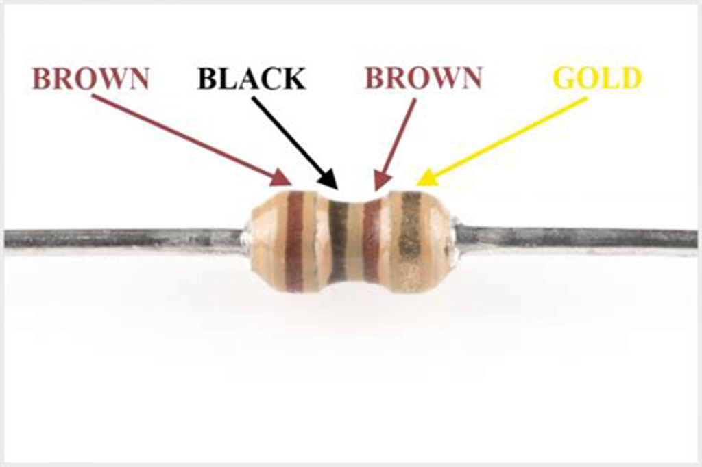
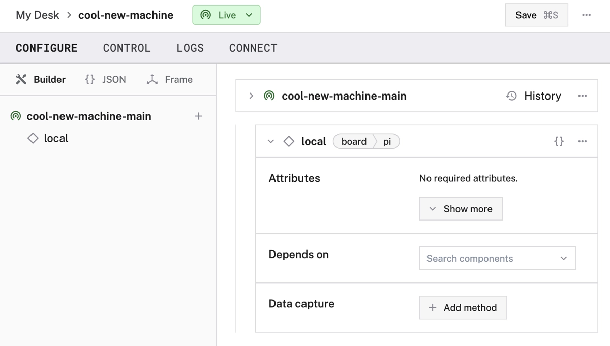
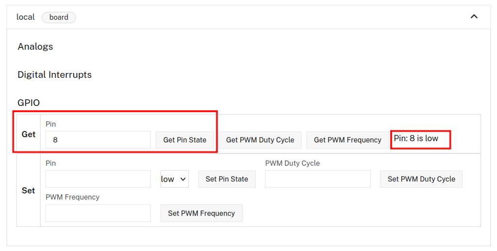
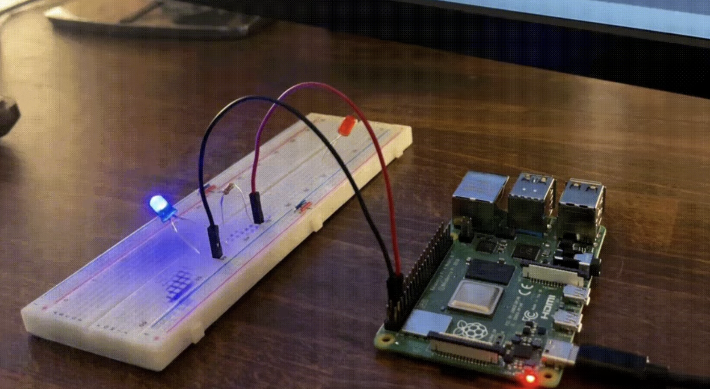
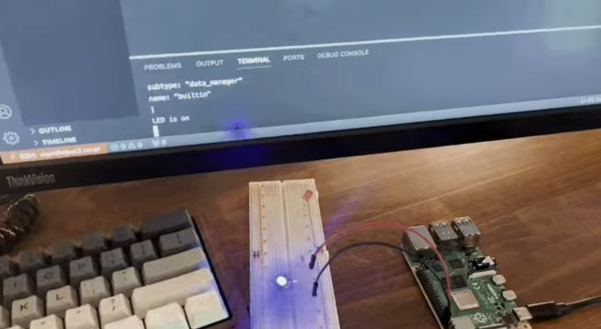

author: Joyce
id: led-blink
summary: Make an LED blink with a Raspberry Pi
categories: Getting-Started, Developer
environments: web
status: Published 
feedback link: https://github.com/viam-labs/viamquickstarts/issues
tags: Getting Started, Developer

# Make an LED Blink With Buttons And With Code
<!-- ------------------------ -->
## Overview 
Duration: 1

Learn how to use Viam to make an LED blink with a Raspberry Pi. 

First, you’ll use the control interface on the [Viam app](https://app.viam.com/) to turn the LED on and off. Then, you’ll write code to control the LED using the Viam [software development kits](https://docs.viam.com/build/program/).



> aside positive
>
> This tutorial was originally shared [in the Viam documentation](https://docs.viam.com/tutorials/get-started/blink-an-led/).

### Prerequisites

- None. This is a great place to start if you have never built a robot or a circuit before.

### What You’ll Learn 

- Set up a circuit
- Use the Viam app to configure and control a machine
- Control your machine using the Viam SDK by writing a short program in either Go or Python to make an LED on your Raspberry Pi blink on and off!

### What You’ll Need 

- Sign up for a free Viam account, and then [sign in](https://app.viam.com).
- You will also use the following hardware for this tutorial:
  - [Raspberry Pi](https://a.co/d/5Tn67G3)
    - Refer to the [Viam Raspberry Pi Setup Guide](https://docs.viam.com/get-started/prepare/rpi-setup/) to set up your Pi.
  - [A solderless breadboard](https://www.amazon.com/dp/B0135IQ0ZC)
  - [Jumper wires](https://amzn.to/2qVhd4y)
  - [Resistor pack](https://amzn.to/2Dmainw)
    - You will use a 100 Ohm resistor, which is the resistor with brown-black-brown bands
  - [An LED](https://amzn.to/2Ex2v5q)

### What You’ll Build 


<!-- ------------------------ -->
## Set up the Raspberry Pi
Duration: 5

Before you build your circuit, you need to set up the operating system on your Raspberry Pi and install `viam-server` on the Pi:

Follow the [Raspberry Pi Setup Guide](https://docs.viam.com/get-started/prepare/rpi-setup/) to set up the operating system.

[Add a new machine](https://docs.viam.com/cloud/machines/#add-a-new-machine) in the [Viam app](https://app.viam.com/). Then follow the setup instructions to install `viam-server` on the computer you’re using for your project and connect to the Viam app. Wait until your machine has successfully connected.

> aside positive
> 
> If you encounter issues, reach out to the [Viam Community Discord](https://discord.com/invite/viam).

### Take a Quiz
<form>
  <name>Where is `viam-server` running in this project?</name>
  <input type="radio" value="The Raspberry Pi">
  <input type="radio" value="Viam cloud servers in Viam's data center">
  <input type="radio" value="The computer where you are taking this quiz">
</form>

Make sure you understand these concepts before moving ahead.

<!-- ------------------------ -->
## Build the circuit
Duration: 3

The next step is to build a simple LED circuit consisting of an LED and a resistor. The resistor protects the LED by limiting the flow of electricity through the circuit and is called a current-limiting resistor.

You will connect the LED and resistor to the [pins](https://en.wikipedia.org/wiki/Pin_%28electronics%29) on the Raspberry Pi to complete the circuit. Since the only power for this circuit comes from a Pi pin, controlling the state of the pin will toggle the LED on or off.

### Understand GPIO pinout
A _general-purpose input/output_ (GPIO) pin is a digital signal pin on a circuit board, like a Raspberry Pi, which may be used as an input or output, or both, and is controllable by software.



**Each pin has a specific role, and you can use it only for that role.** Some of them are input/output, power (3.3V or 5V), or ground. As you can see in the diagram below, there are 40 pins on the Pi. 26 of them are GPIO pins.

Some of the GPIO pins can be used not only as GPIO pins but for other more specific functions as well. The website [pinout.xyz](https://pinout.xyz/) is a helpful resource with the exact layout and role of each pin.



One thing that might be confusing is the _board pin numbering versus GPIO pin numbering_. There are 40 physical pins numbered from 1 to 40. That is board pin numbering, corresponding to the pin’s physical location on the board. Then there’s numbering them by function or GPIO connection. For example, “GPIO 22”. **When working with the GPIO pins with Viam, you will use the board pin numbers**. For example, board pin 38 is the same pin as GPIO pin 20, but when configuring your machine with Viam, you should refer to it as pin `38`.

> aside positive
>
> **TIP**: To make it easier for you to see which pin is which, you can print out [this Raspberry Pi Leaf](https://docs.viam.com/get-started/try-viam/viam-raspberry-leaf-8.5x11.pdf) which has labels for the pins and carefully push it onto the pins or fold or cut it so you can hold it up to the Raspberry Pi pins. If you use A4 paper, use this [this Raspberry Pi Leaf](https://docs.viam.com/get-started/try-viam/viam-raspberry-leaf-A4.pdf) instead.
>
> If you are having trouble punching the pins through, you can pre-punch the pin holes with a pen. Only attach the paper when the Pi is unplugged. To make attaching the paper easier, use a credit card or a small screwdriver.

### Wire your circuit

> aside negative
>
> **CAUTION**: Disconnect your Raspberry Pi and any other electronics from power before touching or moving wires on them.

Now it’s time to wire your circuit according to the diagram below. It doesn’t matter what color jumper wires you use but for reference, the blue wire below connects the LED to ground, and the red wire connects the resistor to pin 8 (GPIO 14).



The resistor and LED need to be in series as in the diagram above. To find the right resistor use the resistor color code – for a 100 ohm resistor, it needs to be brown-black-brown. You can use a multimeter to double-check the resistor value or check yours using the photo below.



When hooking up the circuit, **note the polarity of the LED**. You will notice that the LED has long and short leads. The long lead is the positive side, which is known as the anode. The short lead is the negative side, which is known as the cathode. Connect the long anode to the resistor and the short cathode to ground (pin 6) on the Raspberry Pi.

Now that your circuit is wired, reconnect your Pi to power.

<!-- ------------------------ -->
## Configure your robot
Duration: 4

### Configure your robot

Before proceeding, be sure that you have [connected your Pi to the Viam app](https://docs.viam.com/tutorials/get-started/blink-an-led/#project-setup).

Now it’s time to configure your machine’s components. Go to the [Viam app](https://app.viam.com/) and navigate to your new machine’s **CONFIGURE** tab.

Add a [board component](https://docs.viam.com/components/board/) to represent your single-board computer, which in this case is the Raspberry Pi. To create the new component, click the **+** icon next to your machine part in the left-hand menu and select **Component**. Select the `board` type, then select the `pi` model. Enter a name or use the suggested name for your board and click **Create**. We used the name `"local"`.

Your board component panel will look like this:



Click the **Save** button in the top right corner of the page to save your changes.

### Control your robot using the Viam app

When you configure your board component, the Viam app generates a control panel for it. Click the [**CONTROL** tab](https://docs.viam.com/fleet/control/) to view the control panels for all your machine’s components (in this case, just the board).

Click the board card to expand it. Here, you can click on **Get** to get the current status of your pin. The first time you click **Get Pin State**, it should return “Pin: 8 is low.”



You can now use the **Set** menu to set the status of your pin to **high**. Once you click **Get Pin State** again, it will look like this:


When you set your pin to **high** the LED should illuminate. You can set the pin back and forth between high and low, and you will see your LED turn on or off depending on whether you have the value set to **low** or **high**.



Congratulations! You have just successfully used Viam to make an LED blink with a Raspberry Pi! You have learned how the GPIO on a Raspberry Pi works, and how to build circuits for LED bulbs.

To make your LED blink periodically, you need to use an SDK.

<!-- ------------------------ -->
## Control your robot using the Viam SDKs
Duration: 5

Now you’re ready to control the LED with code so you don’t have to click buttons to turn it on and off.

In this section, you will learn the basics of programming hardware by using either the [Viam Python SDK](https://python.viam.dev/) (software development kit) or the [Viam Go SDK](https://pkg.go.dev/go.viam.com/rdk/robot/client#section-readme) to make your LED blink.

### Install a Viam SDK
Go ahead and install either the [Viam Python SDK](https://python.viam.dev/) or the [Viam Go SDK](https://pkg.go.dev/go.viam.com/rdk/robot/client#section-readme) on your local computer. Use which ever programming language you are most comfortable with.

Refer to the appropriate SDK documentation for SDK installation instructions:

- [Viam Python SDK](https://python.viam.dev/) 
- [Viam Go SDK](https://pkg.go.dev/go.viam.com/rdk/robot/client#section-readme)

### Connect your robot to the Viam SDK
The easiest way to get started writing an application with Viam is to navigate to the CONNECT tab of your machine’s page on the Viam app and select the Code sample page. For this tutorial, we provide Python and Golang code snippets. Select Python or Golang and follow the instructions to connect to your machine.

> aside positive
>
> **API KEY AND API KEY ID**: By default, the sample code does not include your machine API key and API key ID. We strongly recommend that you add your API key and API key ID as an environment variable and import this variable into your development environment as needed.
>
> To show your machine’s API key and API key ID in the sample code, toggle **Include secret** on the **CONNECT** tab’s **Code sample** page.

> aside negative
>
> **CAUTION**: Do not share your API key or machine address publicly. Sharing this information could compromise your system security by allowing unauthorized access to your machine, or to the computer running your machine.

These code snippets import all the necessary libraries and set up a connection with the Viam app in the cloud.

On your local computer, create a file called `blink.py` or `blink.go`. Paste the boilerplate code from the **Code sample** tab of the Viam app into the file in your code editor, and save the file.

You can now run the code. Doing so will ensure that the Viam SDK is properly installed and that the `viam-server` instance on your machine is live.

> aside positive
>
> Follow the section below coresponding to whether you're using the Python SDK or Go SDK.

### Run your code in Python

```bash
python3 <INSERT PATH TO YOUR FILE>/blink.py
```

If you successfully configured your machine and it is able to connect to the Viam app, you should see something like the following printed to the terminal after running your program. What you see here is a list of the various resources that have been configured on your machine in the Viam app (the board, as well as various built-in services).

```bash
python3 my-project-folder/blink.py
2023-07-14 13:05:50,958        INFO    viam.rpc.dial (dial.py:212)
    Connecting to socket: xxxxxxxxxxxx
Resources:
[namespace: "rdk"
type: "service"
subtype: "sensors"
name: "builtin"
, namespace: "rdk"
type: "service"
subtype: "data_manager"
name: "builtin"
, namespace: "rdk"
type: "service"
subtype: "motion"
name: "builtin"
, namespace: "rdk"
type: "component"
subtype: "board"
name: "local"
]
```

### Run your code in Go

Navigate to the directory where your `blink.go` file is saved. Create the necessary `go.mod` and `go.sum` files ([more information on the Go Blog](https://go.dev/blog/using-go-modules)) by running these commands:

```bash
go mod init blink
go mod tidy
```

Then, run your code:

```bash
go run blink.go
```

If you successfully configured your machine and it is able to connect to the Viam app, you should see something like the following printed to the terminal after running your program. What you see here is a list of the various resources that have been configured on your machine in the Viam app (the board, as well as various built-in services).

```bash
go run blink.go
2023-07-14T13:05:50.958-0700        INFO    client my-project-folder/blink.go:41
    Resources:
2023-07-14T13:05:50.958-0700        INFO    client my-project-folder/blink.go:41
    [rdk:component:board/local rdk:service:sensors/builtin
    rdk:service:motion/builtin rdk:service:data_manager/builtin]
```
<!-- ------------------------ -->
## Write code to blink the LED 
Duration: 5

In order to interact with the GPIO pins on our Raspberry Pi, you need to import the [board component](https://docs.viam.com/components/board/) from the Viam SDK.

The **Code sample** page automatically adds the board import for you, but it doesn’t hurt to double-check.

> aside positive
>
>Follow the section below coresponding to whether you're using the Python SDK or Go SDK.

### Write code in Python

At the top of your `blink.py` file, make sure the the following import is included:

```python
from viam.components.board import Board
```

Next, you need to initialize the Raspberry Pi board and tell Viam which GPIO pin your LED is on. At the bottom of the `main` function, paste the following:

```python
# Initialize the board and the LED on pin 8
local = Board.from_robot(robot, 'local')
led = await local.gpio_pin_by_name('8')
```

Now that the board and LED are initialized, let’s create an infinite loop that will blink the LED on and off. Within the `main` function, add the following code to create an infinite loop. You can remove the line to close out the connection to your machine, since the infinite loop will never hit that line.

```python
async def main():
    robot = await connect()

    print('Resources:')
    print(robot.resource_names)

    # Initialize the board and the LED on pin 8
    local = Board.from_robot(robot, 'local')
    led = await local.gpio_pin_by_name('8')

    # Create an infinite loop that will blink the LED on and off
    while (True):
        # True sets the LED pin to high/on.
        await led.set(True)
        print('LED is on')
        await asyncio.sleep(1)

        # False sets the pin to low/off.
        await led.set(False)
        print('LED is off')
        await asyncio.sleep(1)
```

Run your finished code:

```bash
python3 blink.py
```

### Write code in Go

At the top of your `blink.go`, make sure to include the following import statements:

```go
import (
  "fmt"
  "time"
  "go.viam.com/rdk/components/board"
)
```
The `fmt` package enables you to print and the `time` package enables you to add time delays.

Next, you need to initialize the Raspberry Pi board and tell Viam which GPIO pin your LED is on. At the bottom of the `main` function, paste the following:

```go
// Initialize the board
myBoard, err := board.FromRobot(robot, "myBoard")
if err != nil {
    logger.Fatalf("could not get board: %v", err)
}

// Initialize the board's GPIO pin (pin 8) and name it "led"
led, err := myBoard.GPIOPinByName("8")
if err != nil {
    logger.Fatalf("could not get led: %v", err)
}
```

Now that the board and LED are initialized, let’s create an infinite loop that will blink the LED on and off. Within the `main` function, add the following code to create an infinite loop. You can remove the line to close out the connection to your machine, since the infinite loop will never hit that line.

```go
func main() {
  logger := logging.NewLogger("client")
  robot, err := client.New(
      context.Background(),
      "ADDRESS FROM THE VIAM APP",
      logger,
      client.WithDialOptions(rpc.WithEntityCredentials(
      // Replace "<API-KEY-ID>" (including brackets) with your machine's API key ID
      "<API-KEY-ID>",
      rpc.Credentials{
          Type:    rpc.CredentialsTypeAPIKey,
          // Replace "<API-KEY>" (including brackets) with your machine's API key
          Payload: "<API-KEY>",
      })),
  )
  if err != nil {
      logger.Fatal(err)
  }
  defer robot.Close(context.Background())
  logger.Info("Resources:")
  logger.Info(robot.ResourceNames())

  // Initialize the board
  myBoard, err := board.FromRobot(robot, "myBoard")
  if err != nil {
    logger.Fatalf("Could not get board: %v", err)
  }
  // Initialize the board's GPIO pin and name it "led"
  led, err := myBoard.GPIOPinByName("8")
  if err != nil {
    logger.Fatalf("Could not get led: %v", err)
  }

  //   Infinite loop that will blink the LED on and off.
  for {
    // True sets the LED pin to high/on.
    err = led.Set(context.Background(), true, nil)
    if err != nil {
      logger.Fatalf("Could not set led to on: %v", err)
    }
    fmt.Println("LED is on")
    time.Sleep(1 * time.Second)

    // False sets the pin to low/off.
    err = led.Set(context.Background(), false, nil)
    if err != nil {
      logger.Fatalf("Could not set led to off: %v", err)
    }
    fmt.Println("LED is off")
    time.Sleep(1 * time.Second)
  }
}
```
Run your finished code:

```bash
go run blink.go
```

### Celebrate

If all goes well, you should see your LED blinking on and off again every second!



You can exit this program by pressing **Ctrl + C** in your terminal window.

If you get an error, you can check your code against the complete code here:

**Completed code**: [https://github.com/viam-labs/LED-Blink](https://github.com/viam-labs/LED-Blink)

<!-- ------------------------ -->
## Conclusion And Resources
Duration: 1

### What You Learned
- Set up a circuit
- Use the Viam app to configure and control a machine
- Control your machine using the Viam SDK by writing a short program in either Go or Python to make an LED on your Raspberry Pi blink on and off!

### Related Resources
- [Code sample in GitHub repository](https://github.com/viam-labs/LED-Blink)
- [Viam documentation](https://docs.viam.com/)
- [Viam YouTube channel](https://www.youtube.com/channel/UCrWzoQBoTmYnF8mslOesUAw)

Now that you have completed this robotics project, check out some of our [other tutorials](https://docs.viam.com/tutorials/).

> aside positive
>
> **TIP**: If you have any issues getting the Viam SDK set up or getting your code to run on your Raspberry Pi, the best way to get help is over on the [Community Discord](https://discord.gg/viam). There, you will find a friendly developer community of people learning how to make robots using Viam.
