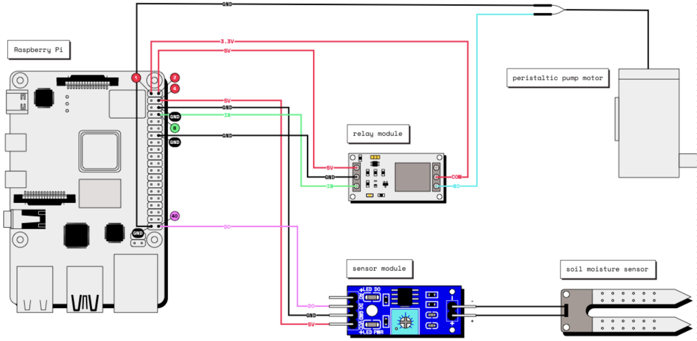
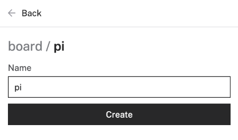

author: Hazal Mestci
id: plant-watering-device-workshop
summary: Build a Plant Watering Device
categories: Getting-Started, Developer
environments: web
status: Draft
feedback link: <https://github.com/viam-labs/viamcodelabs/issues>
tags: Getting Started, Developer, Hardware

# Plant Watering Device Workshop
<!-- ------------------------ -->
## Overview

Duration: 5

Building a useful robot doesn’t have to require complicated code or expensive equipment. With a Raspberry Pi and some cheap, basic hardware, you can keep your plants healthy and happy from anywhere in the world!

Follow this workshop to learn how to set up an automatic plant watering system by wiring the components of the device, configuring it in the Viam app, and coding a simple script to activate the water pump motor.

### Prerequisites

- Sign up for a free Viam account, and then [sign in](https://app.viam.com/robots/) to the Viam app.
- Follow the Raspberry Pi [setup guide](https://docs.viam.com/installation/prepare/rpi-setup/) and flash a Viam-compatible operating system on the Pi. Make sure you are able to SSS into it.
- [Purchase](https://www.amazon.com/hz/wishlist/ls/3D7AOY2LX3PH2) or acquire the hardware necessary for the workshop: a Raspberry Pi with micro-sd card and a power supply, a webcam (optional for the additional sections), a 5V water pump with tubing, a relay module, a moisture sensor, bunch of jumper wires, and wire connectors.
- Have a planter box or flower pot, a screw driver and a water container ready.

### What You’ll Learn

- How to physically assemble a functional plant watering device by connecting and wiring the components.
- How to configure the device’s components using the Viam app.
- How to write Python code using the Viam Python SDK to control the plant watering device by using custom sensor and motor methods.
- How to test and adjust the system for optimal performance.

### What You’ll Need

- All the hardware components listed in prerequisites.
- Python and necessary libraries.
- A [GitHub](https://github.com/) account.
- [VSCode](https://code.visualstudio.com/download) installed, or another similar code editor of your choice.

### What You'll Build

- A smart system that triggers a water pump to irrigate the plant when the soil moisture falls below a certain threshold.

### Watch the Video

Follow along with the step-by-step video.
<video id="Q6UuUKJpDn0"></video>

<!-- ------------------------ -->
## Set up your Plant Watering Device

Duration: 10

Before programming the Pi to make the plant watering robot functional, you need to physically set up the plant watering robot by wiring the different components together. You will set up the robot to receive signals from the resistive soil moisture sensor and signal to the pump when it is time to pump water from the water’s container to the plant’s container.

Refer back to this full wiring diagram as you complete the steps to wire your hardware.



For wiring the sensor module, follow the below chart:

- GPIO 4 (3V) to VCC (Power)
- GPIO 6 (GND) to GND (Ground)
- GPIO 40 (DIGITAL OUTPUT)to DO (Digital Output)

For connecting the soil noisture sensor to the sensor module, + goes to +, and - to -.

For wiring the relay, follow the below chart:

- GPIO 1 (3.3V) to COM
- GPIO 2 (5V) to 5V
- GPIO 14 (GND) to GND
- GPIO 8 (IN) to IN

Last step in the wiring section is connecting the pump and the water tube:

- NO (Normally Open) to pump motor
- GPIO 39 (GND) to pump motor

Now you are done!

### Take a Quiz

<form>
  <name>Where is the sensor module getting its power from?</name>
  <input type="radio" value="The Raspberry Pi">
  <input type="radio" value="Battery pack">
  <input type="radio" value="Electrical socket">
</form>

Make sure you understand these concepts before moving ahead.

## Configure your Plant Watering Device

Duration: 5

- Go to your Viam app account and [sign in](https://app.viam.com/robots/).

- Create a new robot and follow the setup steps.

- Configure your components, start with the board which is the Raspberry Pi.



- Then test your components:

  - In the control tab, get the state of Pin 40. Adjust the moisture sensor sensitivty from the blue screw top notch: This sets a threshold, so that when the soil moisture level exceeds the threshold, the module outputs LOW, otherwise HIGH. Try reading from your pin while you adjust and put the end of the sensor in water.
  - Then test your relay and pump in the control tab by setting the state of Pin 8 high.

## Program your Plant Watering Device

Duration: 10

The example code is in the [Github repository](github.com/viam-labs/plant-watering-workshop). Grab the robot api keys from the Connect tab, Code Sample subtab and insert them in the code provided. This is how your code connects to your device.

In the moisture loop, you are getting the pin values, if the moisture is detected from the sensor (low pin value), it is setting the relay pin to false and not pump any water. If the moisture is not detected (high pin value), it is setting the relay pin to true and pumping water.

```bash
async def moisture_loop(board):
    '''
    moisture_pin value:
    - high: no moisture (True)
    - low: means there is moisture (False)
    '''
    # Main program loop, with relay pin
    moisture_pin = await board.gpio_pin_by_name(MOISTURE_PIN)
    relay_pin = await board.gpio_pin_by_name(RELAY_PIN)
    detect_moisture = await moisture_pin.get()
    
    # debug
    print(f'moisture_loop: {MOISTURE_PIN}:{detect_moisture}')
    if detect_moisture == True:
        # start the relay
        await relay_pin.set(True)
    else:
        # stop the relay
        await relay_pin.set(False)

    # return the status of the relay
    return await relay_pin.get()   
```

The while function in the main function, let's you know if the relay is running or not, and allows you to sleep after certain minutes of being on. This will change depending on the size of the pot and how much water you want to pump each cycle.

``` bash
 while True:
        running = await moisture_loop(pi)
        if running:
            # you can sleep for 5 seconds (depending on size of pot)
            print('relay running')
        else:
            print('relay not running')
        await asyncio.sleep(watering_sleep)
```

<!-- ------------------------ -->
## Next Steps

Duration: 1

Now that you have created your automatic plant watering device with a resistive soil moisture sensor, you can easily use Viam to automate other aspects of your garden. For example:

- You can use a [light sensor](https://www.amazon.com/Sensor-Module-Raspberry-Integrated-Circuits/dp/B07L15M5JG) or a [temperature sensor](https://www.amazon.com/KY-011-Cathode-Arduino-Starter-2-color/dp/B07869PKKF/ref=as_li_ss_tl?keywords=arduino+two+color+led+module&qid=1556591832&s=gateway&sr=8-2&th=1&linkCode=sl1&tag=murraynet-20&linkId=c36cd98be29498a9883b656c7011b6bb&language=en_US) to get readings to optimize the plant health.
- You can set up data capture and [graph your sensor data](/tutorials/services/visualize-data-grafana/), or [create your own custom Typescript dashboard](/tutorials/control/air-quality-fleet/) to display your sensor data.
- You can add a camera and [train a machine learning model](https://docs.viam.com/services/ml/train-model/#train-a-model) to track the health of your plant.

Check out our [documentation](https://docs.viam.com/) for more inspiration.

### What You Learned

- How to assemble and wire a plant watering device using a Raspberry Pi and various sensors.
- How to configure a Raspberry Pi to communicate with sensors and control hardware components.
- How to use the Viam app to configure and manage robot components.
- How to write and run Python code to read sensor data and control a water pump using the Viam Python SDK.
- How to test and adjust the system to ensure it functions correctly in monitoring soil moisture and automating plant watering.
- How to integrate additional sensors or cameras, and expand the system's capabilities for further automation.

### Related Resources

- Github code repository: <https://github.com/viam-labs/plant-watering-workshop/tree/main>
- Tutorial documentation: <https://docs.viam.com/tutorials/projects/make-a-plant-watering-robot/#set-up-your-plant-watering-robot>
