author: Joyce
id: postman-grpc-apis
summary: Get started with Viam's gRPC APIs in Postman
categories: Getting-Started
environments: web
status: Published 
feedback link: https://github.com/viam-labs/viamquickstarts/issues
tags: Getting Started

# Postman tutorial for Viam's gRPC APIs
<!-- ------------------------ -->
## Overview 
Duration: 1

You can use the [Viam web app](https://app.viam.com) to control your machines, or the [Viam SDKs](https://docs.viam.com/sdks/) to develop frontend and backend applications. But if you want to explore what’s happening behind the scenes, let’s use [Viam’s gRPC API](https://www.postman.com/viamrobotics/workspace/viam-apis/overview) to control a rover.

> aside negative
> If you're not working with a rover, follow the same steps shown here for authorization and then use the gRPC methods available for your own machine's resources.

### Prerequisites
- Sign up for a free Viam account, and then [sign in](https://app.viam.com) to the Viam app.
- Set up a rover, such as [Yahboom or SCUTTLE](https://docs.viam.com/tutorials/configure/configure-rover/) or [Viam rover](https://docs.viam.com/get-started/try-viam/rover-resources/rover-tutorial-fragments/)
- [Sign up](https://identity.getpostman.com/signup) for a free Postman account, and then [sign in](https://go.postman.co/). If you're using the web version of Postman, also [download and install](https://www.postman.com/downloads/postman-agent/) the Postman desktop agent.

### What You’ll Learn 
- Authorize the Viam gRPC API
- Invoke API methods available for your machine's resources
- Use variables in Postman to store data

### What You’ll Need 
- A free [Viam](https://app.viam.com) Account
- A machine running on Viam
- A free [Postman](https://identity.getpostman.com/signup) Account

### What You’ll Build 
- A working Postman collection to control and interact with your Viam machine

### Watch the Video

Follow along with the step-by-step video.

<video id="KaJIXznpssw"></video>

<!-- ------------------------ -->

## Fork the sample collection

Duration: 2

### Fork the collection

In Postman, [fork](https://learning.postman.com/docs/collaborating-in-postman/version-control/#forking-postman-entities) the following collection to your own workspace.

> aside negative
> 
>  Fork this collection: **[Spin a Viam rover](https://www.postman.com/viamrobotics/workspace/viam-examples/collection/669fcf9f04dc6b500411069b)**

1. Select the collection in the sidebar.
1. Select the overflow menu (**...**), and **Fork** the collection.
  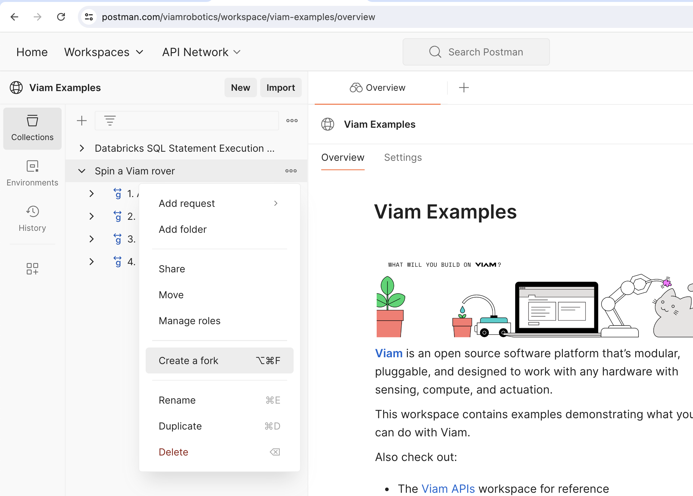
1. Enter a label for your fork, and select a workspace to save it to.
1. Select **Fork Collection**.
  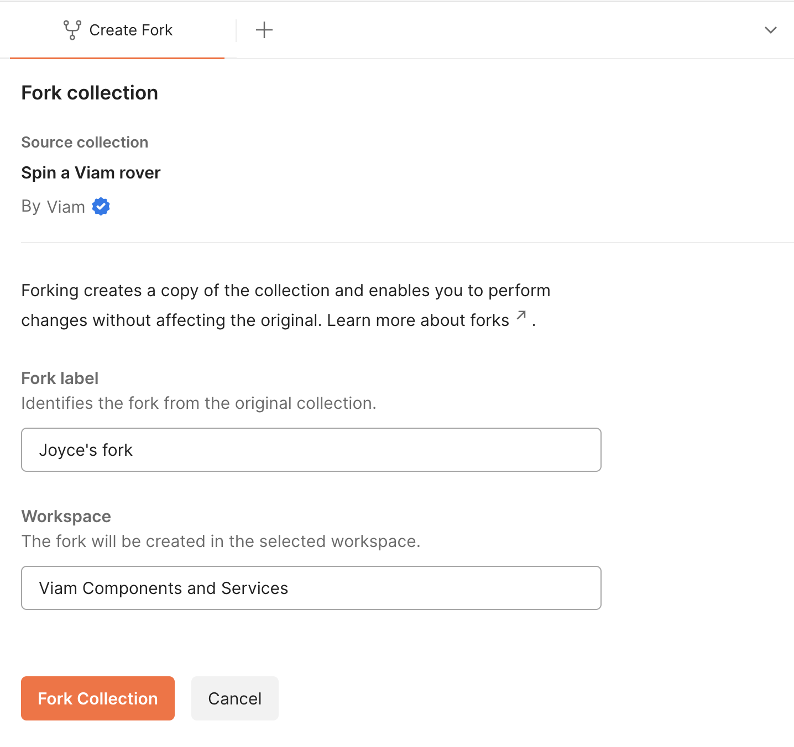

Postman creates your fork in the selected workspace. You can now update this version of the collection as you wish. If you optionally chose to watch the collection, you can pull changes to your own collection when the main collection is updated.

For each folder and request, review the companion documentation in the context bar to the right.

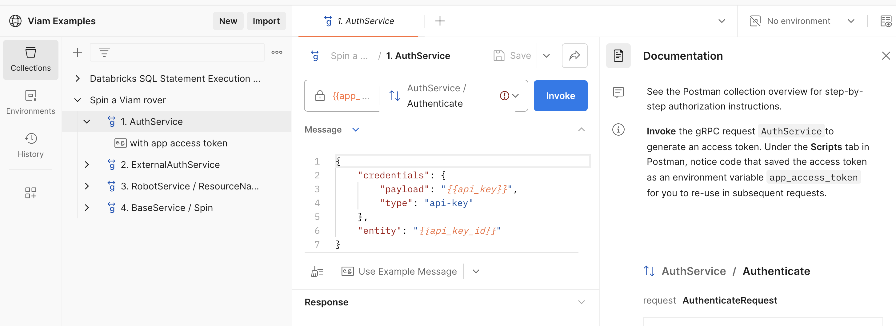

<!-- ------------------------ -->

## Authorize API requests

Duration: 4

### Find your Viam credentials

1. To find the API key and API key ID, go to the [Viam app](https://app.viam.com), select the machine you wish to connect to, and under the **Connect** tab, select a code sample language. Toggle **Include API key**, and then copy and paste the API key ID and API key to update your Postman variables
  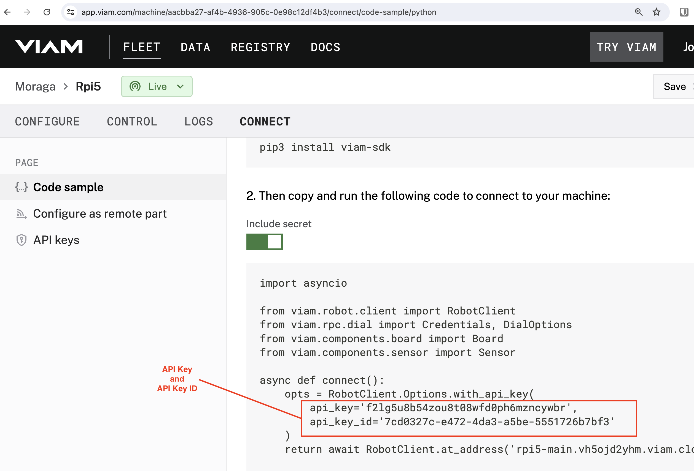
1. To find the machine address, go to the [Viam app](https://app.viam.com), select the machine you wish to connect to, and under the **Status** dropdown, copy the **Remote address** to update your Postman variable.
  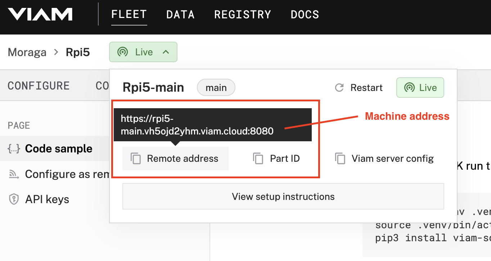
1. Input your credentials for `api_key`, `api_key_id`, and `machine_url` as Postman variables and **Save** your changes.
  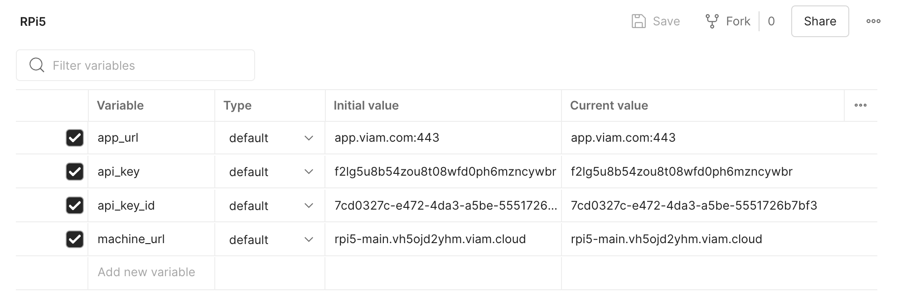

In the next section, let's learn about generating access tokens.

### Authorization

To authorize subsequent calls to the Viam server running on your smart machine, generate access tokens in Postman.

1. Invoke the `AuthService / Authenticate` method to generate an access token. Under the **Messages** tab, notice you are using your `api_key` and `api_key_id` to authorize the call to the `app_url`. Under the **Scripts** tab, notice code that saved the access token as a variable `app_access_token` for you to re-use in subsequent requests.
  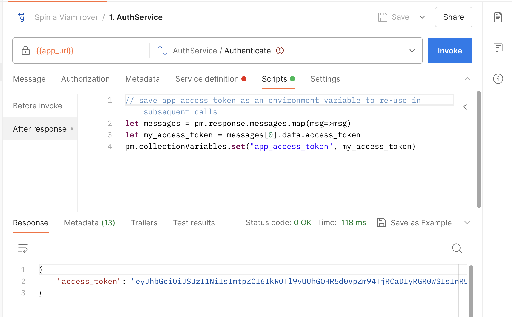
1. Invoke the `ExternalAuthService / AuthenticateTo` method to generate an access token. Under the **Scripts** tab, notice code that saved the access token as a variable `machine_access_token`.
1. For subsequent calls to Viam gRPC services, you can include the `machine_access_token` variable under the **Authorization** tab expressed with double curly braces like `{{machine_access_token}}` using the `Bearer token` authorization type in order to make calls to your `machine_url`.
  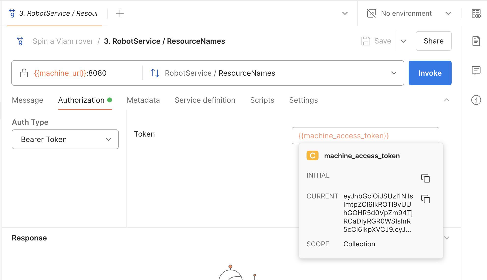

Check out the documentation for more details about each request in the context bar on the right side of Postman.

<!-- ------------------------ -->

## Spin a Viam rover

Duration: 2

### Get resource names
1. Invoke the `RobotService / ResourceName` method to get a list of resources associated with your machine. Notice you are using your `machine_access_token` to authorize the call to your `machine_url`.
  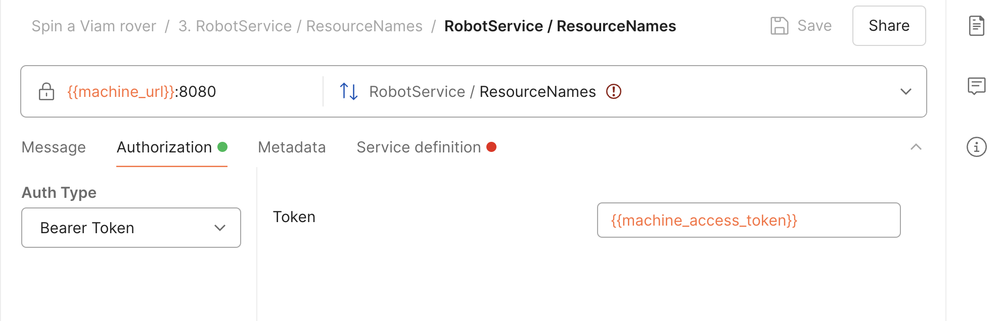
1. In the server response, find the `base` component, and make a note of the component's `name`. We will need it for the next step.
  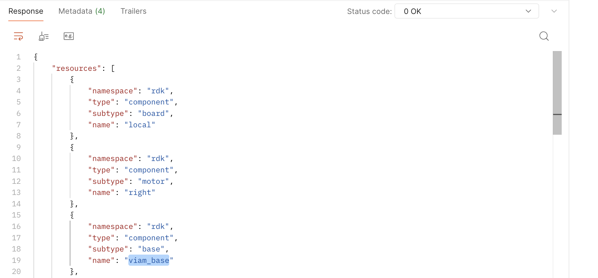

### Spin a Viam rover
1. Open the `BaseService / Spin` request. Once again, you are using your `machine_access_token` to authorize the call to your `machine_url`. This time, additional information is required. Under the **Messages** tab of your request, update the `name` property to the name of your own `base` component retrieved in the previous step.
  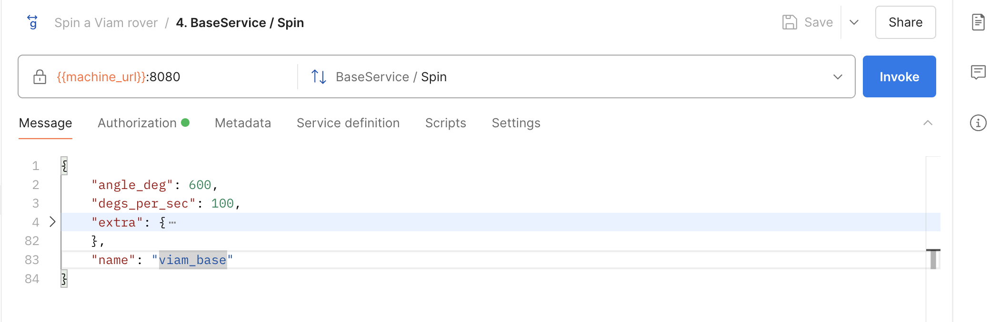
1. Invoke the method to spin your rover.

From here, you can continue updating the payload, exploring other hardware [Components](https://docs.viam.com/components/), software [Services](https://docs.viam.com/services/), and experiment with other cloud capabilities, such as [machine learning](https://docs.viam.com/services/ml/). 

<!-- ------------------------ -->

## Next Steps

Duration: 1

This tutorial was a hands-on introduction to the Viam gRPC API. Browse other methods available using server reflection, or see some of them documented in the [Viam gRPC API collection](https://www.postman.com/viamrobotics/workspace/viam-apis/collection/6618689b086edda70e6d65ba) as a reference. Read more about [how Viam uses gRPC and WebRTC for system architecture](https://hackernoon.com/poor-network-conditions-no-problem-grpc-and-webrtc-for-robots-can-help).
  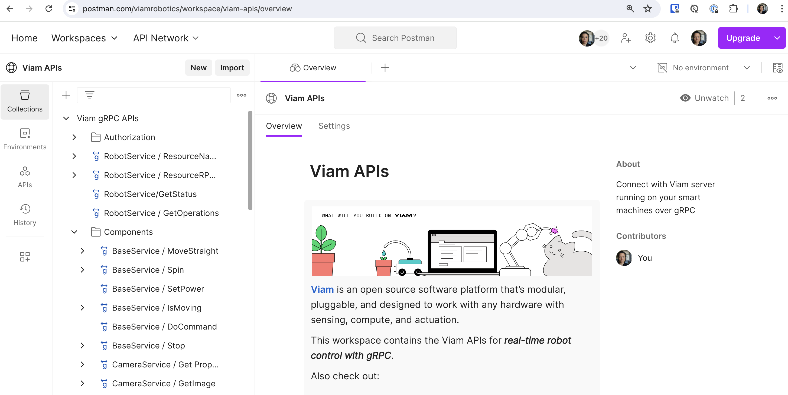

In most cases, you won't be developing applications or controlling them using the raw gRPC APIs. Instead, check out these resources:

- The [Viam SDK libraries](https://docs.viam.com/sdks/) for development
- The [Viam web app](https://app.viam.com) for ad hoc controls

Once you learn the fundamentals of working with your machine, you can start adding more intelligence and capabilities, such as the following.

- [Viam Data Management](https://docs.viam.com/services/data/): Collect data from different parts of a robot, IoT device, or any other machine
- [Viam Fleet management](https://docs.viam.com/fleet/): Organize, manage, and control any number of machines alone or in collaboration with others
- [Viam Registry](https://docs.viam.com/registry/): Add and share a modular resource on your robot
