author: Joyce
id: shana-tobot
summary: Robotic arm that dips apples into honey
categories: Getting-Started, Developer
environments: web
status: Published
feedback link: https://github.com/viam-labs/viamcodelabs/issues
tags: Getting Started, Developer

# Dip apples in honey with Shana ToBot

<!-- ------------------------ -->

## Overview

Duration: 1

Dipping apples in honey is a Jewish tradition on Rosh Hashanah, the Jewish new year, to symbolize a sweet new year. In this tutorial, you will program a robotic arm to dip apples in honey - no more sticky hands!

Watch the [Instagram post](https://www.instagram.com/reel/DAlMmAkRrqU/) to see a working demonstration.

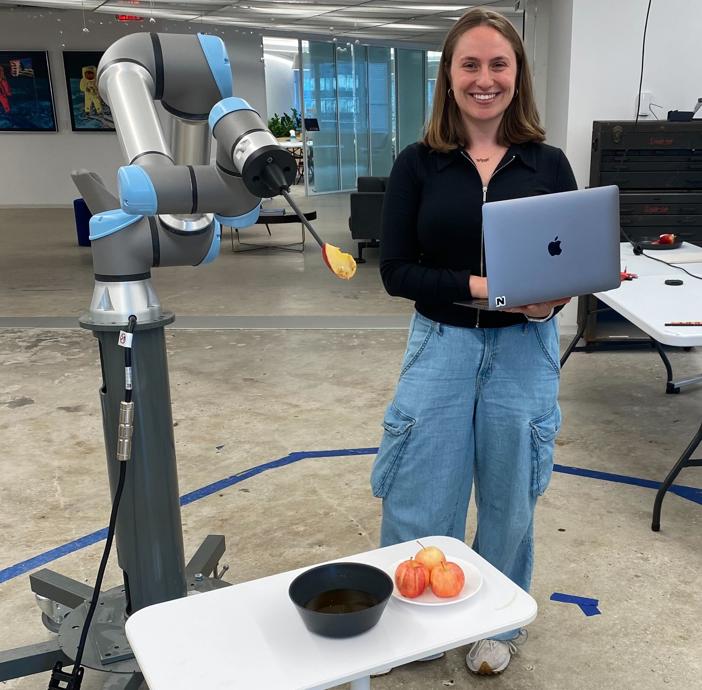

### Prerequisites

- Sign up for a free Viam account, and then [sign in](https://app.viam.com).
- Install the [Viam Python SDK](https://python.viam.dev/) on your computer.

### What You’ll Learn

- How to interact with a robotic arm component
- How to verify the state and positioning of an arm
- How to issue movement commands to your robotic arm

### What You’ll Need

- A computer running Mac, Windows, or Linux
- [VS Code](https://code.visualstudio.com/download) installed, or your preferred code editor
- [Python3](https://www.python.org/downloads/) installed
- Access to a robotic arm
  - If you do not have a robotic arm of your own, Viam provides a [fake arm component](https://docs.viam.com/components/arm/fake/) to set up a virtual robotic arm with the same kinematic model as a real robotic arm.

### What You’ll Build

- A program for a robot arm to dip apples in honey

<!-- ------------------------ -->

## Add a Viam machine

Duration: 2

### Add a new Viam machine

1. In [the Viam app](https://app.viam.com/robots), create a machine by typing in a name and clicking **Add machine**.
   
1. Click **View setup instructions**.
   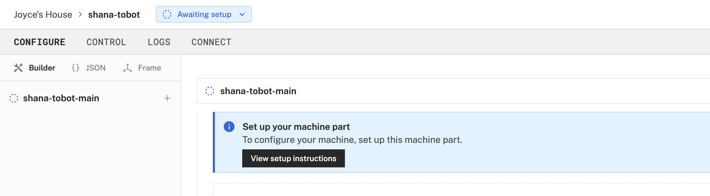
1. Install `viam-server` on the device that you want to use to communicate with and control your robot arm. For example, select the `Mac` platform if you want to use your Mac computer to control the arm. If you're using a different computer, select the platform appropriate for your setup.
   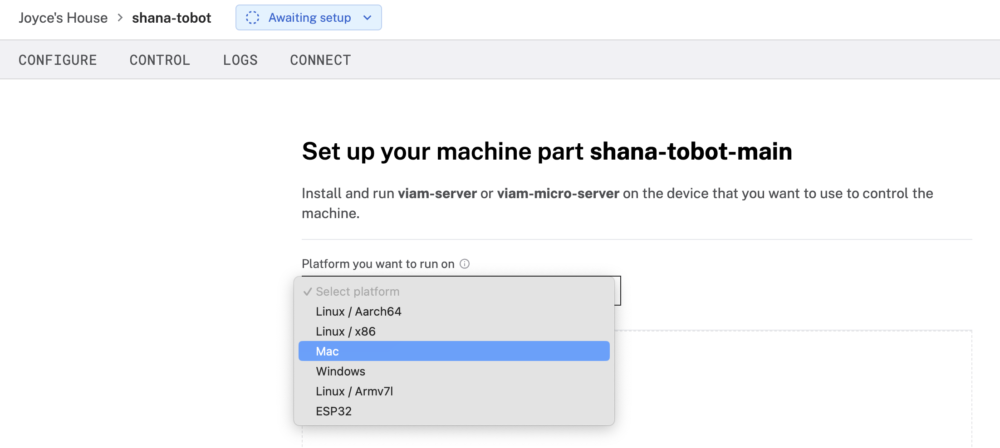
1. Following the rest of the installation instructions on the setup page, install `viam-server` on your computer by entering the provided CLI command into your terminal prompt. The example shown here is on a Mac.
   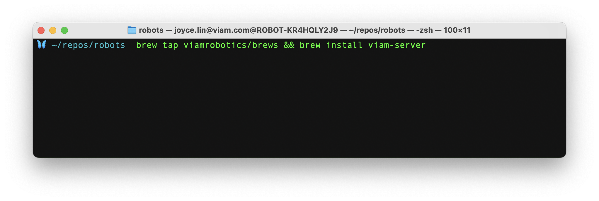
1. Download the machine cloud credentials file to your computer for `viam-server` to connect to `app.viam.com`.
1. Run `viam-server` locally on your computer with the config you just downloaded. If your download in the previous step went to a different folder, modify the file path.
   ```bash
   viam-server -config ~/Downloads/viam-shana-tobot-main.json
   ```
1. The setup page will indicate when the machine is successfully connected.
   

<!-- ------------------------ -->

## Configure your machine

Duration: 2

### Configure your machine

Now that our machine is live, let's [configure an arm component](https://docs.viam.com/tutorials/services/accessing-and-moving-robot-arm/).

1. Under the **CONFIGURE** tab for your live machine, click on the **+** symbol next to your machine in the left sidebar and select **Component** in the menu that opens.
   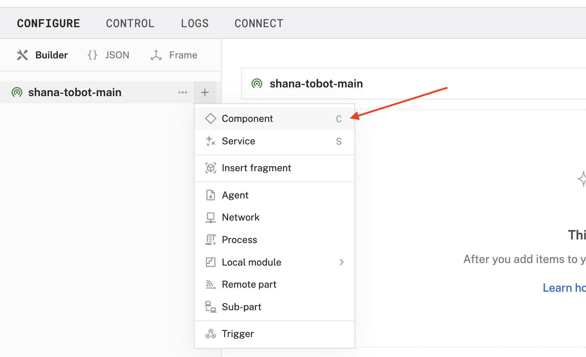
1. Choose arm as the type, and then choose your desired model. For example, if you’re using a UR5e, choose the `ur5e` model from the list.
   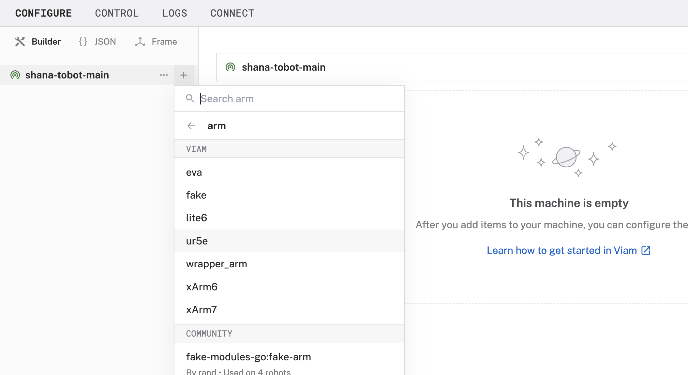
1. Leave the default name, and then click **Create**.
   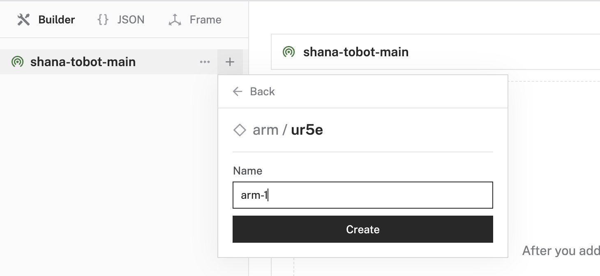
1. In the newly created component panel, configure any attributes as needed. Refer to the documentation for the model for information about your arm’s model. In the example shown here, we are using a `ur5e` arm model, inputting a required `host` field with the arm's IP address, and moving at a speed of `20` degrees per second.
   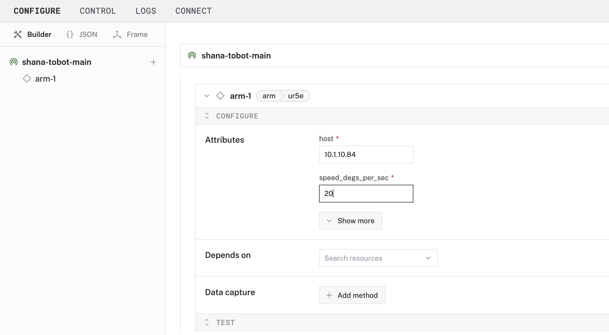
1. **Save** your machine's configuration.

<!-- ------------------------ -->

## Control your machine

Duration: 5

> aside negative
> **⚠️ Caution**: Be careful when instructing robot arms to move. Before running any code, ensure your robotic arm has enough space and that there are no obstacles. Also pay attention to your surroundings, double-check your code for correctness, and make sure anyone nearby is aware and alert before issuing commands to your machine.

### Control your machine from the Viam app

1. Under the **CONTROL** tab of your live machine, find the corresponding panel for your configured arm.
   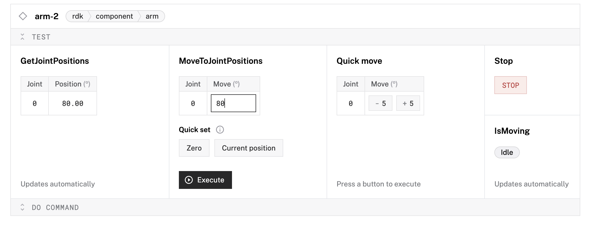
1. Experiment with getting joint positions to fetch data about the robotic arm’s current position, and moving joint positions.

### Control your machine with code

Now that you know how to work with your robotic arm using the Viam app, learn how to program your arm using code.

1. Under the **CONNECT** tab of your live machine, select the Python SDK we'll use to access the arm. Follow the instructions to install the Python SDK if you haven't already.
1. Toggle on `Include API key` to see your machine credentials in the boilerplate code below. Make a note of your `API-KEY`, `API-KEY-ID`, and `MACHINE-ADDRESS-URI` for the next steps.
   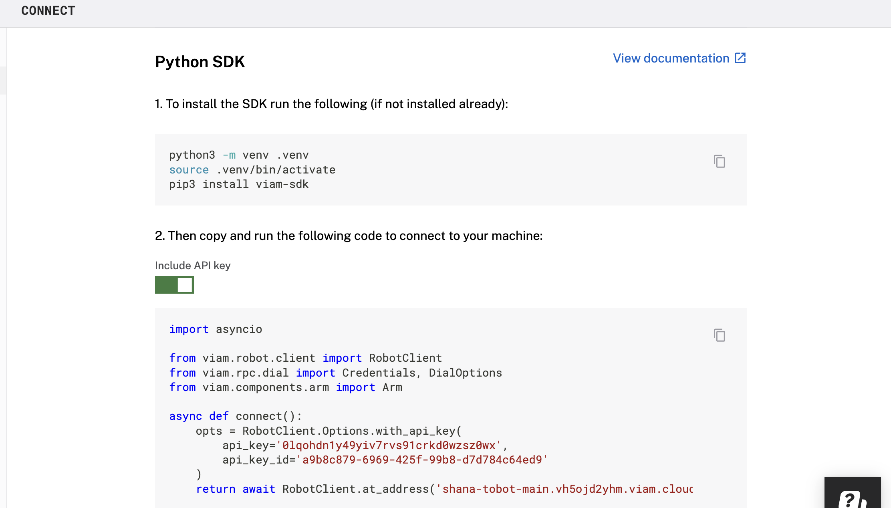
1. From the command line of your terminal window, create a new file to contain your script.
   ```bash
   touch script.py
   ```
1. To program the movement of the robotic arm, copy and paste the following Python code into `script.py` using your preferred code editor. Be sure to replace the placeholders for `&lt;API-KEY&gt;`, `&lt;API-KEY-ID&gt;`, and `&lt;MACHINE-ADDRESS-URI&gt;` with your own machine credentials from the previous steps.

   ```python
   import asyncio

   from viam.robot.client import RobotClient
   from viam.rpc.dial import Credentials, DialOptions
   from viam.components.arm import Arm
   from viam.proto.component.arm import JointPositions
   from viam.proto.common import Pose
   import time

   async def connect():
     opts = RobotClient.Options.with_api_key(
         api_key='<API-KEY>',
         api_key_id='<API-KEY-ID>'
     )
     return await RobotClient.at_address('<MACHINE-ADDRESS-URI>', opts)

   async def main():
     machine = await connect()

     print('Resources:')
     print(machine.resource_names)

     # move arm to exact end position then get coordinates:
     # arm
     arm = Arm.from_robot(machine, "arm-1")
     arm_return_value = await arm.get_end_position()
     print(f"arm get_end_position return value: {arm_return_value}")

     # hard coded end position - grabbed from terminal output
     x = -117.89177530820058
     y = 810.53648219876914
     z = -86.077008874770044
     o_x = -0.15705296827522847
     o_y = 0.24567021047557136
     o_z = -0.95654613732994043

     cmd_arm_pose = Pose(x=x, y=y, z=z, o_x=o_x, o_y=o_y, o_z=o_z)

     #Move to bowl
     await arm.move_to_position(pose=cmd_arm_pose)

     #adjust to go a little deeper into the honey
     my_arm_joint_positions = await arm.get_joint_positions()
    newJointPos = JointPositions(
        values=[
            my_arm_joint_positions.values[0],
            my_arm_joint_positions.values[1] + 6,
            my_arm_joint_positions.values[2],
            my_arm_joint_positions.values[3],
            my_arm_joint_positions.values[4],
            my_arm_joint_positions.values[5],
        ]
    )
     print("dipped")

     time.sleep(2)

     #what are current joints?
     my_arm_joint_positions = await arm.get_joint_positions()
     print(f"myArm get_joint_positions return value: {my_arm_joint_positions}")

     #lift joint 1 and joint 3
     newJointPos =  JointPositions(values=[my_arm_joint_positions.values[0], my_arm_joint_positions.values[1]-40, my_arm_joint_positions.values[2]+25, my_arm_joint_positions.values[3]-30, my_arm_joint_positions.values[4], my_arm_joint_positions.values[5]])

     #move
     await arm.move_to_joint_positions(positions=newJointPos)
     print("lifted")

     # Don't forget to close the machine when you're done!
     await machine.close()

   if __name__ == '__main__':
     asyncio.run(main())
   ```

   > aside negative
   > It is recommended that you add your API key and API key ID as environment variables and import the variables into your development environment as needed. Check out this step-by-step codelab for [how to work with Python environment variables](https://codelabs.viam.com/guide/environment-variables/index.html?index=..%2F..index#0).

1. Save your changes, and then run the script from your command line.
   ```bash
   python3 script.py
   ```

### Customize the robotic arm

In addition to continuing to refine the code, you can also refine the robotic arm. In our example, to dip a sliced apple in a bowl of honey, it was helpful to repurpose the gripper by adding a skewer (in this case a chopstick). For your own use case, a different utensil with different properties and form might be more helpful.

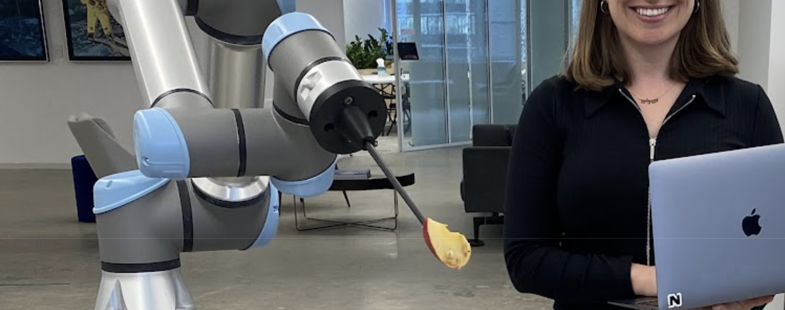

<!-- ------------------------ -->

## Next Steps

Duration: 2

The Viam [`arm` component library](https://docs.viam.com/appendix/apis/components/arm/) has several methods to simplify accessing and working with robotic arms. Learn [how to work with joint positions and poses](https://docs.viam.com/tutorials/services/accessing-and-moving-robot-arm/) to quickly adjust one or more elements of position AND orientation simultaneously, by modifying other elements of the original arm pose.

### What You Learned

- How to interact with a robotic arm component
- How to verify the state and positioning of an arm
- How to issue movement commands to your robotic arm

### Related projects

- [Build a menorah lighting robot](https://www.viam.com/post/guide-to-building-a-menorah-lighting-robot) tutorial
  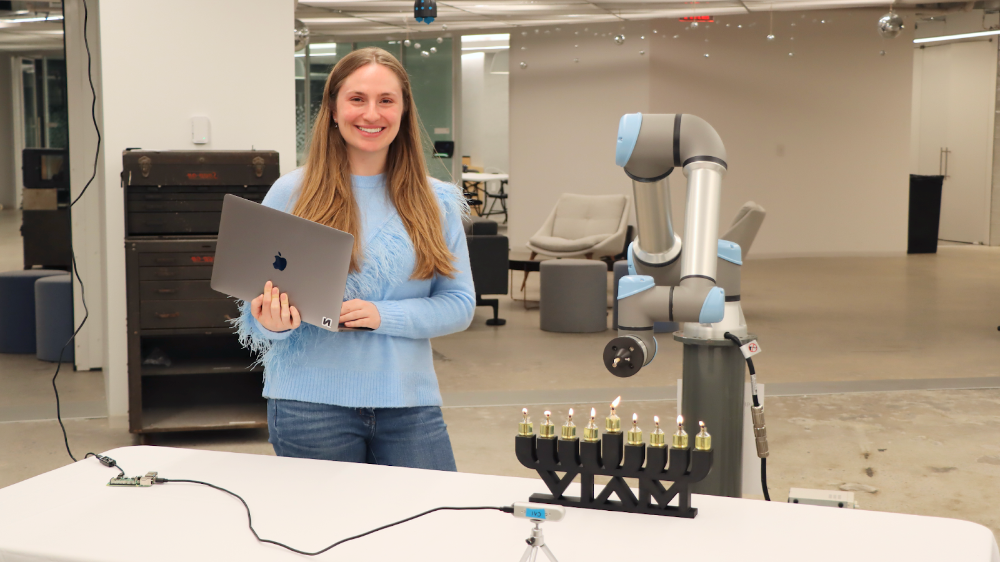
- [Plan Motion with an Arm and a Gripper](https://docs.viam.com/tutorials/services/plan-motion-with-arm-gripper/) tutorial
- [Build a Robotic Claw Game with a Raspberry Pi](https://docs.viam.com/tutorials/projects/claw-game/) tutorial
